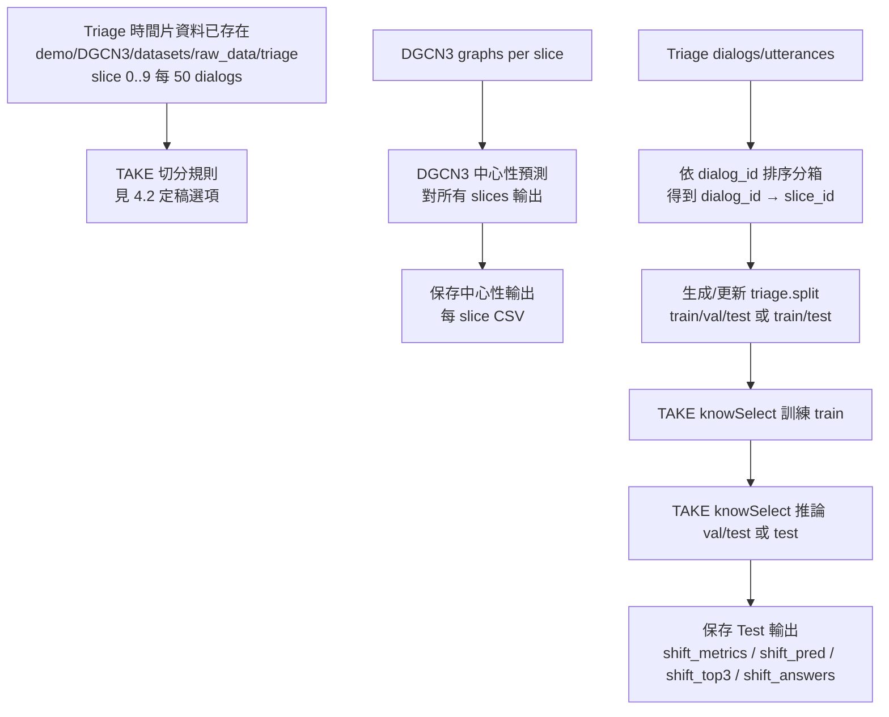

# 規劃提案：Tiage 依時間片切分（Train/Val/Test）與輸出保存（DGCN3 全片預測；TAKE 依時間片切分）

> 狀態：**待你批准（Approved）後才會開始修改程式碼與腳本**
>
> 需求來源：
> - `docs/20260118需求.md`
> - 你於對話補充（本提案以此版本為準）：
>   - **DGCN3 不需要划分資料集**：需對所有時間片進行中心性預測
>   - **切時間片方式（Tiage）**：將 dialogs 按 `dialog_id` 排序，每連續 **50 個 dialogs** 構成一個時間片網路（共 10 片，slice 0–9）
>   - **時間片資料已切好**：路徑 `demo/DGCN3/datasets/raw_data/tiage`，共 **10 個時間片**（每片一個網路快照）
>   - **TAKE（knowSelect）依時間片切分資料集**：slice **0–7** 為訓練集，slice **8–9** 為測試集，並**保存測試集的模型輸出結果**
>   - 你同時也提到「0–5 訓練 / 6–7 驗證 / 8–9 測試、保存驗證與測試輸出」；本提案將其列為「選項 A」供你決定是否保留驗證集

---

## 一、目標（What / Why）

### 1.1 核心目標

- **時間片網路（已切好）**：`demo/DGCN3/datasets/raw_data/tiage` 已提供 slice 0–9 的網路快照（切片規則：每 50 dialogs 一片）。
- **DGCN3**：對所有 slices（0–9）輸出中心性預測（不做 train/val/test 切分）。
- **TAKE（knowSelect）**：依時間片切分資料集（Train/Val/Test 或 Train/Test），並保存 **Val/Test 或 Test** 的模型輸出結果（可追溯、可重跑對照）。

### 1.2 納入範圍（本提案會做）

- **DGCN3**：不做資料集切分；僅確認/補強「對所有 slices 輸出中心性預測」的可追溯性（輸出目錄/檔名規則/文檔）。
- **TAKE（knowSelect）**：以 slice 切分對話資料，推論時產出 **Val/Test 或 Test** 的輸出檔（包含 shift 指標與逐句標籤、區間 Top-3、GPT‑2 shift 事件回答）。
- **scripts**：新增或調整 `scripts/*.sh` 讓整段流程可用腳本執行（符合你規範「禁止直接 python」的要求）。

### 1.3 不納入範圍（本提案不做）

- 不改 Tiage 原始資料生成流程（除非為了產生 slice 對照表與 split 檔不可避免）。
- 不做大規模重構（只做最小必要變更以達成切分/落檔/可驗證）。

---

## 二、現況盤點（As-is）

### 2.1 DGCN3 目前切分方式（需調整）

`demo/DGCN3/data.py:get_data()` 目前採 **train_test_ratio** 做「尾端切分」：
- `train_dataset = dataset[:-len_test_dataset]`
- `test_dataset = dataset[-len_test_dataset:]`

你已確認 **DGCN3 不需要切分**；因此本提案將不再要求 DGCN3 改成 Train/Val/Test，只需要：

- DGCN3 對所有 slices 做中心性預測（0–9）
- 產物可清楚對應 slice（檔名/目錄）

### 2.2 TAKE（knowSelect）目前切分方式（需調整）

- `knowSelect/datasets/tiage/tiage.split` 目前只有 `train/test`，沒有 `val/dev`。
- `knowSelect/dataset/Utils_TAKE.py:split_data()` 對 tiage 目前回傳 `train/dev/test`，但 dev 其實是空（因 split 檔沒有）。

此外，需求要求「依時間片切分」，而 knowSelect 的 episode 目前是以 `query_id` 組對話，未直接帶 slice 欄位；需要一個 **node_id → slice_id** 的對照才能真正按 slice 切分。

---

## 三、設計方案（To-be）

### 3.0 命名提醒（避免文件與程式脫節）

- 專案內資料夾與檔名使用 **`tiage`**（不是 `triage`）。本文件如出現 `triage`，視為筆誤，應以 `tiage` 為準。

### 3.1 高階流程（Mermaid）

---

## 四、關鍵設計：如何得到「dialog_id → slice_id」並落到 split 檔（本提案的核心風險點）

要做到「TAKE 依時間片切分」，我需要能判定每個 dialog（進而每個 utterance）屬於哪個 slice。

### 方案（已定案）：依 dialog_id 排序分箱（每 50 dialogs 一片）

- 以 `demo/tiage-1/outputs_nodes/tiage_anno_nodes_all.csv` 取得所有 `dialog_id`
- 將 `dialog_id` 排序後，按順序分箱：
  - 第 0–49 個 dialogs → slice 0
  - 第 50–99 個 dialogs → slice 1
  - …
  - 第 450–499 個 dialogs → slice 9
- 由此得到 `dialog_id -> slice_id`，進而可生成 `tiage.split`（train/test）

> **仍需你確認的一點（避免歧義）**：若總 dialogs 數不是 500 的整數倍，最後一片是否允許少於 50 dialogs？本提案預設：✅ 允許。

### 4.2 TAKE 切分定稿選項（需你最後確認是否保留驗證集）

你目前訊息同時出現兩種切分口徑；本提案把它明確化為兩個選項，請你擇一作為最終需求：

- **選項 A（Train/Val/Test）**：0–5 訓練、6–7 驗證、8–9 測試，並保存 **Val + Test** 輸出
- **選項 B（Train/Test）**：0–7 訓練、8–9 測試，並保存 **Test** 輸出（你最新一句話指定的是此選項）

---

## 五、落地規格（Outputs）

### 5.1 DGCN3：切分與保存

- **不做資料集切分**：DGCN3 需對所有 slices（0–9）輸出中心性預測
- **保存項目（至少）**：每個 slice 的中心性預測 CSV（現況即為 `tiage_<slice>.csv`）

> 註：目前 `dgcn3_export_predictions.py` 會輸出全部 slices；本提案會補充「如何在文檔/目錄上清楚標示哪些屬於 Val/Test」，必要時可額外複製到 `Centrality/split_{val|test}/`（需你決定是否要）。

### 5.2 TAKE（knowSelect）：切分與保存（Val/Test 或 Test）

以 `knowSelect/output/<name>/metrics/` 為主，必須保存（依 4.2 選項）：

- **逐句 shift 預測**：`shift_pred.jsonl`（內含 `pred_shift` 0/1、`turn_id`）
- **shift 事件與區間 Top-3**：`shift_top3.jsonl`（內含 `shift_events[*].interval_top3[*].turn_id`）
- **shift 指標**：`shift_metrics.json`、`ablation_results.csv`
- **shift 事件 GPT‑2 回答**：`shift_answers_<split>_<epoch>.txt`

若採選項 A：需保存 split=val 與 split=test  
若採選項 B：只需保存 split=test

---

## 六、需要修改/新增的檔案（最小變更清單）

### 6.1 DGCN3

- **不需要**因切分修改 DGCN3 訓練/資料切分邏輯（依你要求）
- 僅需確認 DGCN3 中心性匯出腳本會輸出所有 slices（現況已輸出 0–9）

### 6.2 TAKE（knowSelect）

- 新增一個「以 slice 產生 split 檔」的工具（建議放在 `scripts/` 封裝呼叫）
  - 輸入：`demo/tiage-1/outputs_nodes/tiage_anno_nodes_all.csv`（取得 `dialog_id`）+ 既有 TAKE 的 `*.answer` 或 `*.query`（取得 `query_id` 前綴對應 dialog）
  - 輸出：更新/重產 `knowSelect/datasets/tiage/tiage.split`，包含 `train/test`
  - 切分規則：slice 0–7 → train；slice 8–9 → test
- `knowSelect/dataset/Utils_TAKE.py`
  - 確認 `load_split()` 讀取 `train/test` 正常（現況已支援）
- `knowSelect/TAKE/Run.py`
  - inference 時保存 test 輸出結果（現況已保存），並確保 split=test 的紀錄可追溯

### 6.3 scripts（必做）

- 新增或更新：
  - `scripts/run_tiage_pipeline.sh`：在 pipeline 前加入「依 dialog_id/每 50 dialogs 生成 tiage.split」步驟
  - `scripts/run_take_tiage_infer.sh`：推論跑 test 並保存輸出
  - `scripts/smoke_check_tiage_outputs.sh`：檢查 test 輸出是否存在且欄位正確

---

## 七、驗收標準（DoD）

### 7.1 切分驗收

- TAKE：
  - `tiage.split` 必須包含 `train/test`
  - train 對應 slice 0–7、test 對應 slice 8–9（依 dialog_id 分箱而得）
  - test 推論輸出必須存在且可區分（split=test）

### 7.2 輸出驗收（Test 必須可回溯）

- `shift_pred.jsonl`（test）中每筆包含 `turn_id` 且 `pred_shift ∈ {0,1}`
- `shift_top3.jsonl`（test）中 `shift_events[*].interval_top3[*].turn_id` 必須存在
- 生成 `shift_answers_<split>_<epoch>.txt`（test）且內容含：
  - 轉移句
  - 轉移句中心性
  - 區間 Top-3（含 turn_id）

---

## 八、仍需你最後確認（Approval Gate）

你已批准並定稿如下（將依此直接實作）：

1. **TAKE 切分口徑**：選項 **B**（Train：slice 0–7；Test：slice ≥8）
2. **dialog_id 排序規則**：**數值排序**（`int(dialog_id)`）
3. **dialogs 數量邊界**：
   - 不足 50：**允許**（最後一片可少於 50 dialogs）
   - slices > 10：**允許**（此時 slice ≥8 仍視為 test）

