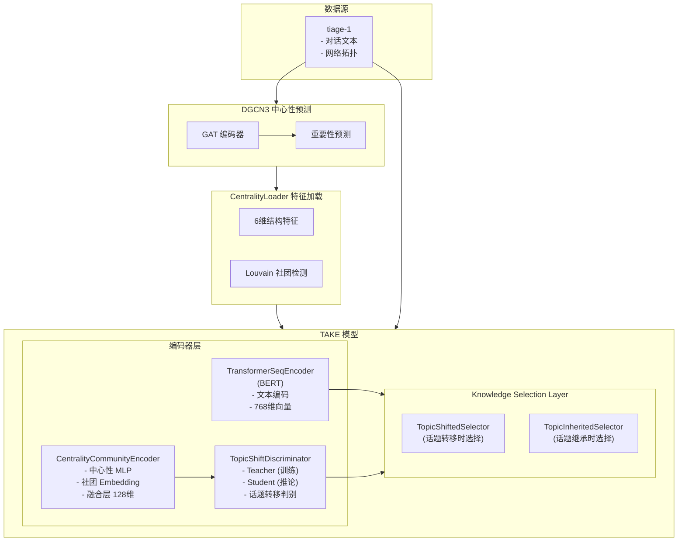
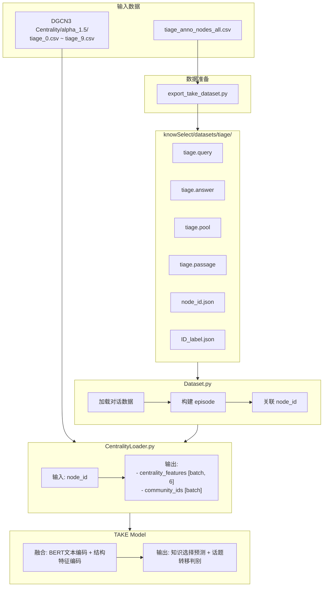
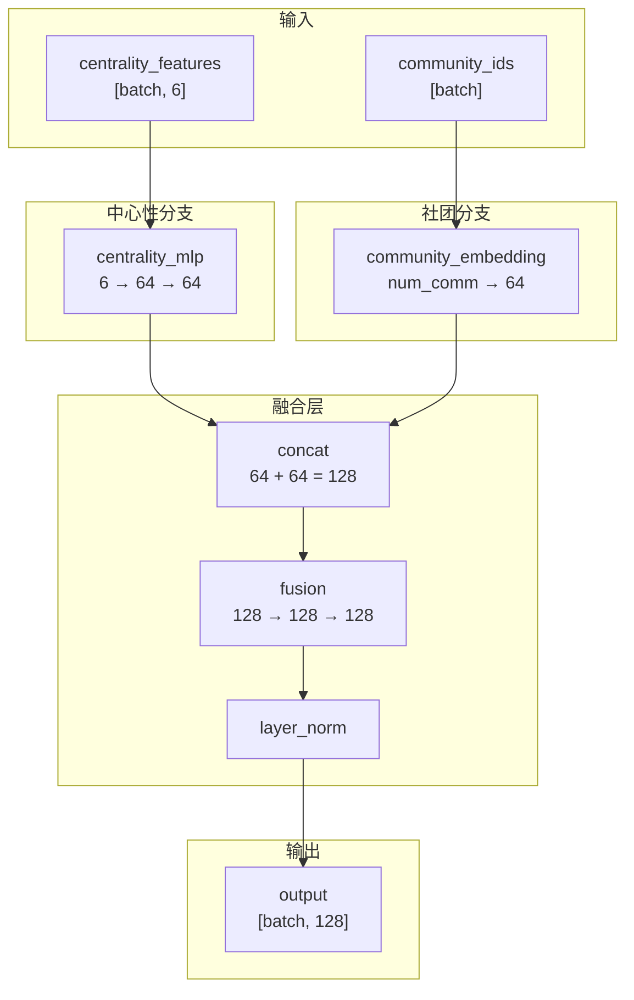
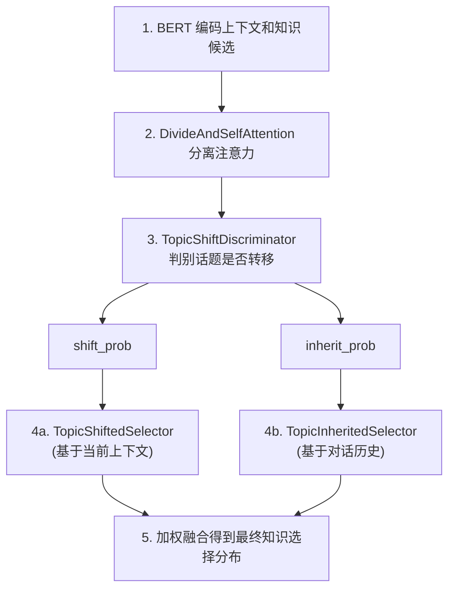
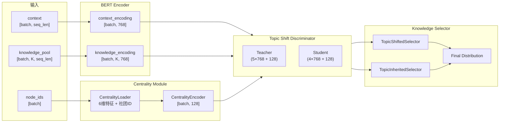
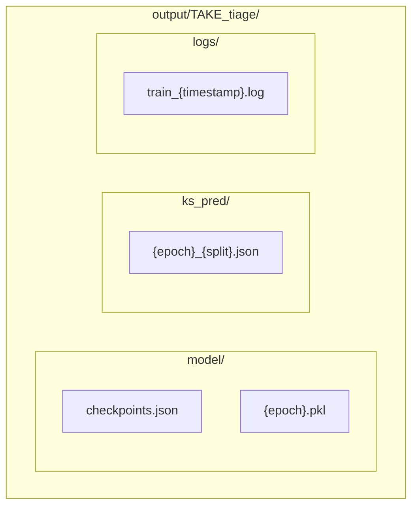
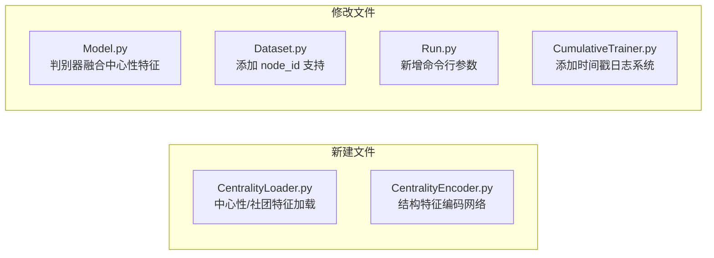

# TAKE + DGCN3 算法架构文档

> 本文档说明 TAKE 模型与 DGCN3 中心性预测整合后的算法结构、输入输出，以及与 `IMPLEMENTATION_PLAN.md` 的对应关系。

---

## 目录

1. [整体架构概览](#一整体架构概览)
2. [数据流程](#二数据流程)
3. [模块详解](#三模块详解)
4. [输入输出规格](#四输入输出规格)
5. [与实施计划对应关系](#五与实施计划对应关系)

---

## 一、整体架构概览

### 1.1 系统架构图



### 1.2 核心组件

| 组件 | 文件路径 | 功能 |
|------|----------|------|
| **DGCN3** | `demo/DGCN3/` | 基于 GAT 的节点重要性预测 |
| **CentralityLoader** | `knowSelect/TAKE/CentralityLoader.py` | 加载中心性预测，计算6维结构特征 |
| **CentralityEncoder** | `knowSelect/TAKE/CentralityEncoder.py` | 将结构特征编码为128维向量 |
| **TAKE Model** | `knowSelect/TAKE/Model.py` | 话题感知的知识选择模型 |
| **Dataset** | `knowSelect/TAKE/Dataset.py` | 数据加载与批处理 |

---

## 二、数据流程

### 2.1 训练数据流



### 2.2 批次数据结构

```python
# collate_fn 返回的 batch 数据结构
batch = {
    'episode_id': [batch],                                    # 对话ID
    'context': [batch, max_episode_length, context_len],      # 上下文编码
    'response': [batch, max_episode_length, max_dec_length],  # 回复编码
    'knowledge_pool': [batch, max_episode_length, max_knowledge_pool, knowledge_sentence_len],
    'knowledge_piece_mask': [batch, max_episode_length, max_knowledge_pool],
    'knowledge_label': [batch, max_episode_length],           # 知识标签
    'Initiative_label': [batch, max_episode_length],          # 话题转移标签 (-1/0/1)
    'episode_mask': [batch, max_episode_length],              # 有效位置掩码
    'node_ids': [batch, max_episode_length]                   # 节点ID (新增)
}
```

---

## 三、模块详解

### 3.1 CentralityLoader - 结构特征加载器

**位置**: `knowSelect/TAKE/CentralityLoader.py`

**功能**: 加载 DGCN3 预测的中心性值，计算6维结构特征

**6维结构特征**:

| 特征名 | 说明 | 计算方式 |
|--------|------|----------|
| `imp_raw` | 原始重要性分数 | DGCN3 预测值 |
| `imp_pct` | 重要性分位数 | 对话内排名 / 对话长度 |
| `imp_delta_prev` | 与上一句的变化 | imp_pct[t] - imp_pct[t-1] |
| `imp_delta_next` | 与下一句的变化 | imp_pct[t+1] - imp_pct[t] |
| `imp_z_local` | 局部窗口 z-score | (x - mean) / (std + 1e-6) |
| `imp_minus_window_mean` | 与窗口均值差 | x - window_mean |

**接口**:

```python
class CentralityCommunityLoader:
    def __init__(
        self,
        dgcn_predictions_dir: str,   # DGCN3 预测目录
        edge_lists_dir: str,          # 边列表目录 (用于社团检测)
        node_mapping_csv: str,        # 节点映射文件
        alpha: float = 1.5,           # SIR alpha 参数
        num_slices: int = 10,         # 时间片数量
        feature_set: str = "all",     # 特征集 (none/imp_pct/all)
        window_size: int = 2          # 局部窗口大小
    )

    def get_batch_features(
        self,
        node_ids: torch.Tensor,       # [batch]
        device: torch.device
    ) -> Tuple[torch.Tensor, torch.Tensor]:
        # 返回: (centrality_features [batch, 6], community_ids [batch])
```

### 3.2 CentralityEncoder - 结构特征编码器

**位置**: `knowSelect/TAKE/CentralityEncoder.py`

**功能**: 将6维结构特征 + 社团ID 编码为128维密集向量

**网络结构**:



### 3.3 TopicShiftDiscriminator - 话题转移判别器

**位置**: `knowSelect/TAKE/Model.py`

**修改**: 融合层输入维度增加128维 (中心性特征)

**Teacher Discriminator** (训练时使用):
- 输入: `5 * hidden_size + 128` = `5 * 768 + 128 = 3968`
- 使用 gold knowledge 辅助判别

**Student Discriminator** (推论时使用):
- 输入: `4 * hidden_size + 128` = `4 * 768 + 128 = 3200`
- 不使用 gold knowledge

### 3.4 TAKE 主模型

**位置**: `knowSelect/TAKE/Model.py`

**知识选择流程**:



### 3.5 完整模型数据流



---

## 四、输入输出规格

### 4.1 DGCN3 输出

**路径**: `demo/DGCN3/Centrality/alpha_1.5/tiage_{0-9}.csv`

**格式** (无表头):
```csv
node_id,centrality
0,0.8234
741,0.5621
...
```

### 4.2 tiage 数据集文件

**路径**: `knowSelect/datasets/tiage/`

| 文件 | 格式 | 说明 |
|------|------|------|
| `tiage.query` | 文本 | 每行一个查询 |
| `tiage.answer` | TSV | `history_ids\tcurrent_id\tknowledge_ids\tresponse` |
| `tiage.pool` | 每行ID列表 | 知识候选池 |
| `tiage.passage` | 文本 | 每行一个知识片段 |
| `tiage.split` | TSV | `query_id\ttrain/test` |
| `ID_label.json` | JSON | `{query_id: shift_label}` |
| `node_id.json` | JSON | `{query_id: node_id}` |

### 4.3 训练输出

**路径**: `knowSelect/output/TAKE_tiage/`



### 4.4 训练指标

| 指标 | 说明 |
|------|------|
| `loss_ks` | 知识选择损失 |
| `loss_distill` | 知识蒸馏损失 (Teacher → Student) |
| `loss_ID` | 话题转移判别损失 |
| `ks_acc` | 知识选择准确率 |
| `ID_acc` | 话题转移判别准确率 |

---

## 五、与实施计划对应关系

### 5.1 任务对应表

| IMPLEMENTATION_PLAN 任务 | 当前实现状态 | 对应文件 |
|--------------------------|--------------|----------|
| **任务A**: DGCN3 预测保存 | ✅ 已完成 | `demo/DGCN3/Centrality/` |
| **任务B**: tiage → TAKE 数据准备 | ✅ 已完成 | `knowSelect/datasets/tiage/` |
| **任务C**: 中心性特征整合 | ✅ 已完成 | `CentralityLoader.py`, `CentralityEncoder.py` |
| **任务C**: 话题判别器融合 | ✅ 已完成 | `Model.py` (修改 Discriminator) |
| **任务C**: Dataset 添加 node_id | ✅ 已完成 | `Dataset.py` |
| **任务C**: Run.py 参数扩展 | ✅ 已完成 | `Run.py` |
| **日志系统** | ✅ 已完成 | `CumulativeTrainer.py` |

### 5.2 文件修改清单



### 5.3 消融实验配置

根据 `IMPLEMENTATION_PLAN.md` 第5.1.3节:

| 配置 | `--centrality_feature_set` | 说明 |
|------|---------------------------|------|
| A1 | 不使用 `--use_centrality` | 纯文本基线 |
| A2 | `imp_pct` | 仅使用重要性分位数 |
| A3 | `all` | 使用全部6维结构特征 |

---

## 附录: 关键代码位置

| 功能 | 文件 | 行号 (约) |
|------|------|-----------|
| TAKE 主类初始化 | `Model.py` | 267+ |
| 混合知识选择层 | `Model.py` | 300-400 |
| 中心性特征注入 | `Model.py` | 330-350 |
| Teacher Discriminator | `Model.py` | 165-206 |
| Student Discriminator | `Model.py` | 210-249 |
| Dataset collate_fn | `Dataset.py` | 198-210 |
| 训练日志输出 | `CumulativeTrainer.py` | 198-230 |
