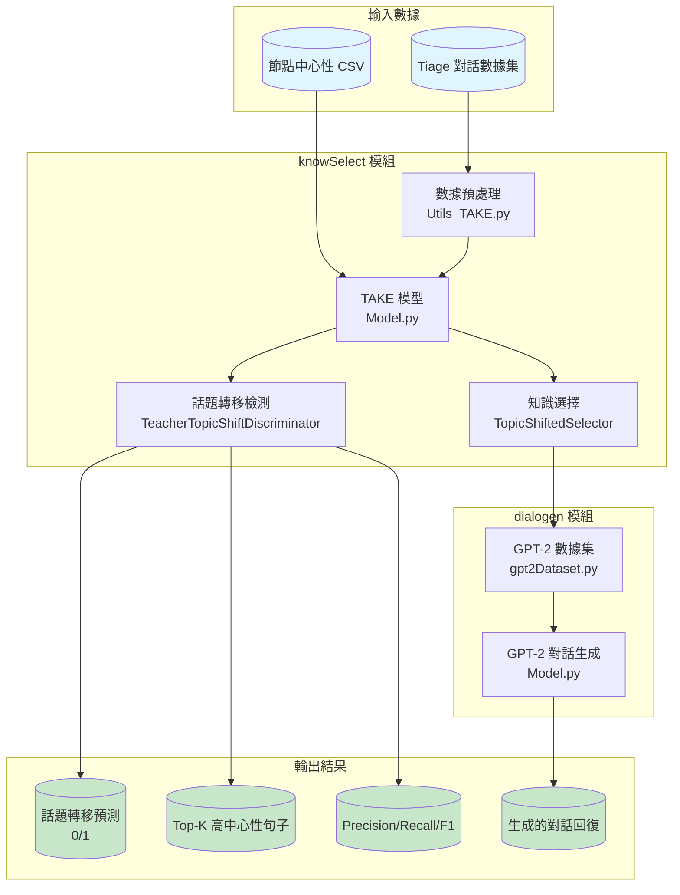
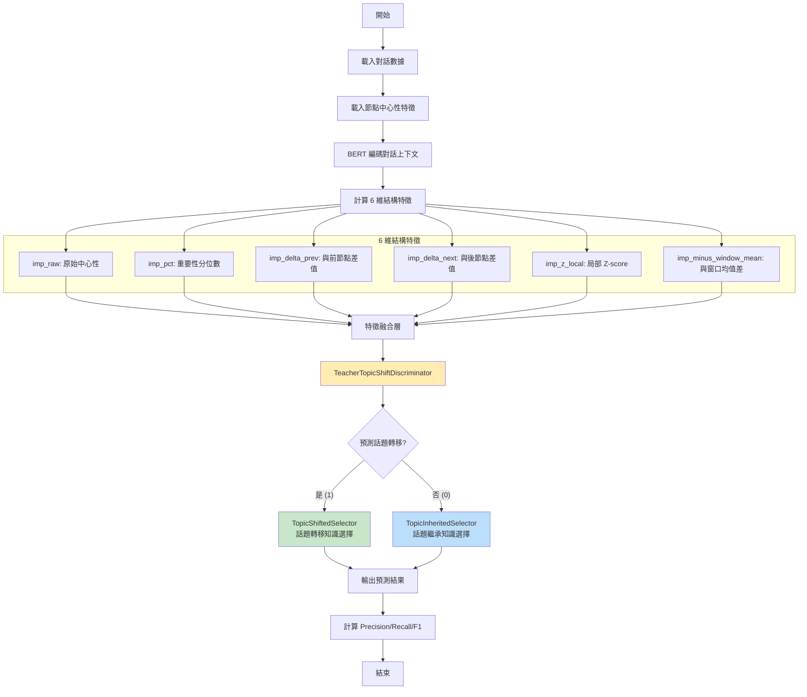
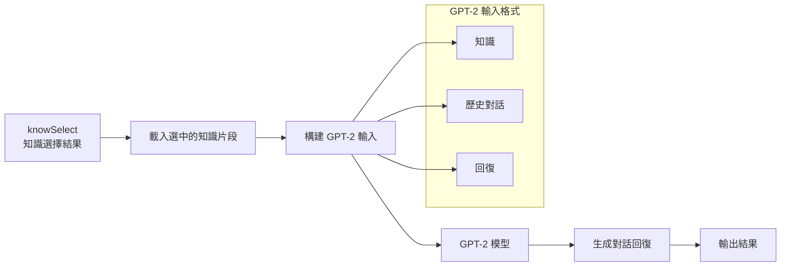
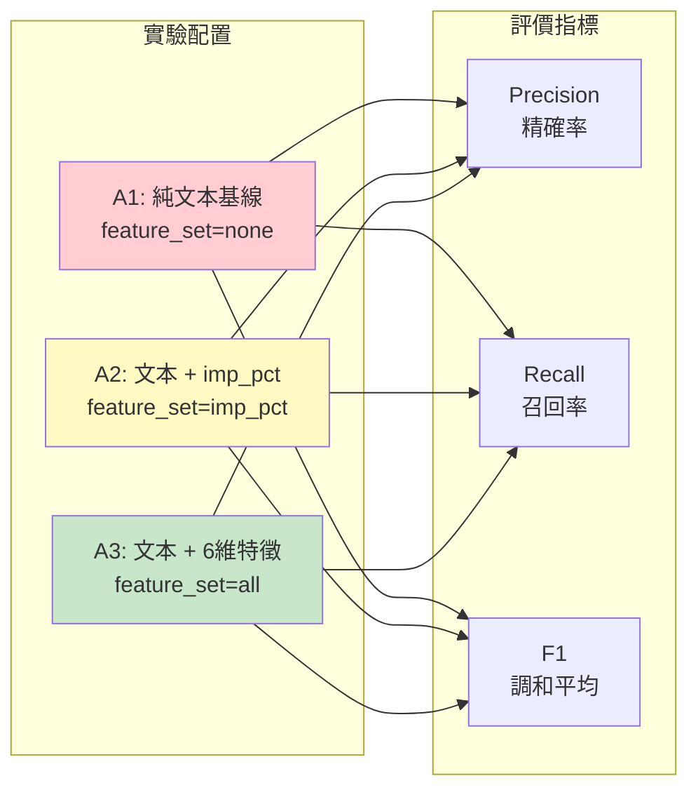
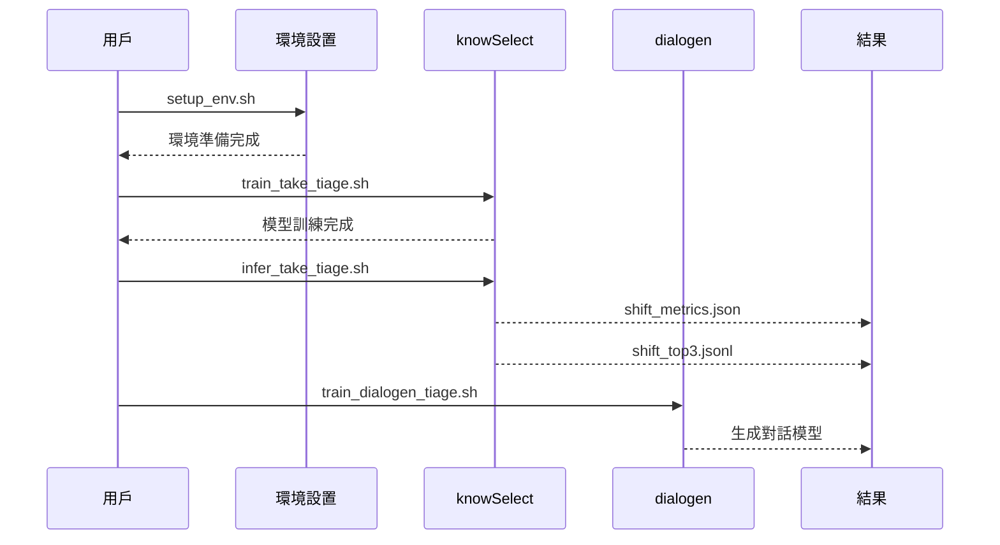
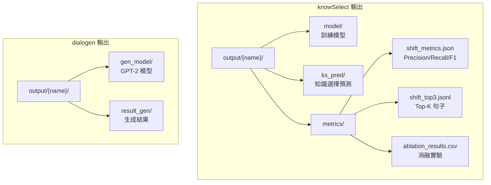
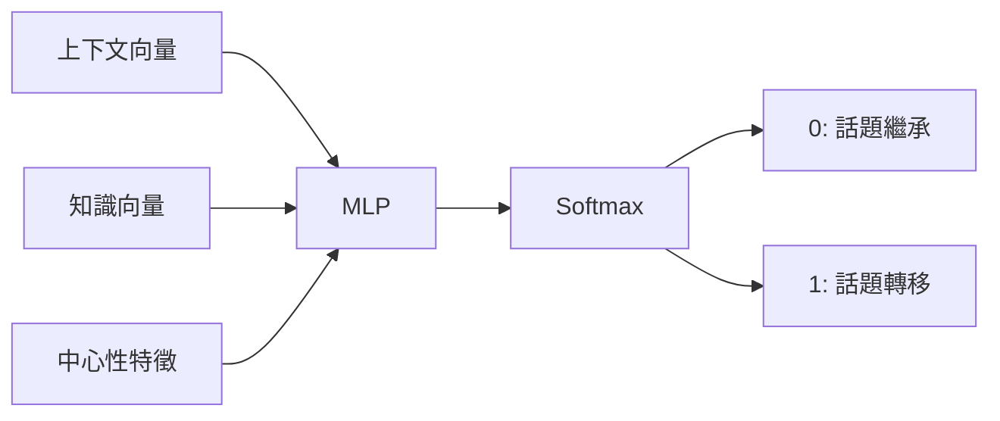

# TAKE + Tiage 話題轉移檢測系統文檔

> 基於 TAKE 模型與 Tiage 數據集的話題轉移檢測與對話生成系統

---

## 1. 系統架構概覽



---

## 2. 算法流程

### 2.1 話題轉移檢測流程



### 2.2 GPT-2 對話生成流程



---

## 3. 消融實驗設計



| 配置 | 描述 | 特徵 |
|------|------|------|
| A1 | 純文本基線 | 不使用中心性特徵 |
| A2 | 文本 + imp_pct | 僅使用重要性分位數 |
| A3 | 文本 + 6維特徵 | 使用全部結構特徵 |

---

## 4. 評價指標說明

| 指標 | 公式 | 說明 |
|------|------|------|
| **Precision** | TP / (TP + FP) | 預測為話題轉移中，真正是話題轉移的比例 |
| **Recall** | TP / (TP + FN) | 所有真實話題轉移中，被正確預測的比例 |
| **F1** | 2 × P × R / (P + R) | Precision 和 Recall 的調和平均數 |

---

## 5. 腳本使用指南

### 5.1 完整流程



### 5.2 腳本對照表

| 腳本 | 平台 | 功能 |
|------|------|------|
| `setup_env.sh` / `.bat` | Linux/Windows | 環境初始化 |
| `train_take_tiage.sh` / `.bat` | Linux/Windows | knowSelect 訓練 |
| `infer_take_tiage.sh` / `.bat` | Linux/Windows | knowSelect 推論 |
| `ablation_take_tiage.sh` / `.bat` | Linux/Windows | 消融實驗 |
| `train_dialogen_tiage.sh` / `.bat` | Linux/Windows | GPT-2 訓練 |

### 5.3 快速開始

#### Linux / macOS

```bash
# 1. 設置環境
./scripts/setup_env.sh

# 2. 訓練話題轉移檢測模型
./scripts/train_take_tiage.sh

# 3. 執行推論並獲取評價指標
./scripts/infer_take_tiage.sh

# 4. 運行消融實驗（可選）
./scripts/ablation_take_tiage.sh

# 5. 訓練 GPT-2 對話生成模型
./scripts/train_dialogen_tiage.sh
```

#### Windows (CMD / PowerShell)

```batch
REM 1. 設置環境
scripts\setup_env.bat

REM 2. 訓練話題轉移檢測模型
scripts\train_take_tiage.bat

REM 3. 執行推論並獲取評價指標
scripts\infer_take_tiage.bat

REM 4. 運行消融實驗（可選）
scripts\ablation_take_tiage.bat

REM 5. 訓練 GPT-2 對話生成模型
scripts\train_dialogen_tiage.bat
```

> **提示**: Windows 用戶也可以使用 PowerShell 腳本 `train_take_tiage.ps1`

---

## 6. 輸出文件說明



### 6.1 shift_metrics.json 格式

```json
{
  "9_test": {
    "run": "TAKE_tiage_all_feats",
    "dataset": "test",
    "epoch": "9",
    "precision": 75.32,
    "recall": 68.45,
    "f1": 71.72
  }
}
```

### 6.2 shift_top3.jsonl 格式

```json
{
  "run": "TAKE_tiage_all_feats",
  "dataset": "test",
  "dialog_id": "1",
  "shift_found": true,
  "shift_top3": [
    {"node_id": 42, "sentence": "話題轉移句子內容...", "centrality": 0.8523},
    {"node_id": 38, "sentence": "第二高中心性句子...", "centrality": 0.7891},
    {"node_id": 45, "sentence": "第三高中心性句子...", "centrality": 0.7234}
  ]
}
```

---

## 7. 核心模組說明

### 7.1 特徵計算 (CentralityLoader)

```python
# 6 維結構特徵計算
features = [
    imp_raw,              # 原始中心性值
    imp_pct,              # 重要性分位數 (0-1)
    imp_delta_prev,       # 與前一節點的中心性差值
    imp_delta_next,       # 與後一節點的中心性差值
    imp_z_local,          # 局部窗口內的 Z-score
    imp_minus_window_mean # 與窗口均值的差值
]
```

### 7.2 話題判別器 (TeacherTopicShiftDiscriminator)



---

## 8. 數據集結構

```
knowSelect/datasets/tiage/
├── tiage.answer      # 回答數據
├── tiage.query       # 查詢數據
├── tiage.passage     # 知識段落
├── tiage.pool        # 知識池
├── tiage.split       # 訓練/測試劃分
├── node_id.json      # 節點ID映射
└── ID_label.json     # 話題轉移標籤
```

---

## 9. 常見問題

### Q1: 如何查看評價指標？

**Linux/Mac:**
```bash
cat knowSelect/output/TAKE_tiage_all_feats/metrics/shift_metrics.json
```

**Windows:**
```batch
type knowSelect\output\TAKE_tiage_all_feats\metrics\shift_metrics.json
```

### Q2: 如何查看 Top-K 高中心性句子？

**Linux/Mac:**
```bash
head -10 knowSelect/output/TAKE_tiage_all_feats/metrics/shift_top3.jsonl
```

**Windows (PowerShell):**
```powershell
Get-Content knowSelect\output\TAKE_tiage_all_feats\metrics\shift_top3.jsonl -First 10
```

### Q3: 消融實驗結果在哪裡？

**Linux/Mac:**
```bash
cat knowSelect/output/TAKE_tiage_all_feats/metrics/ablation_results.csv
```

**Windows:**
```batch
type knowSelect\output\TAKE_tiage_all_feats\metrics\ablation_results.csv
```
