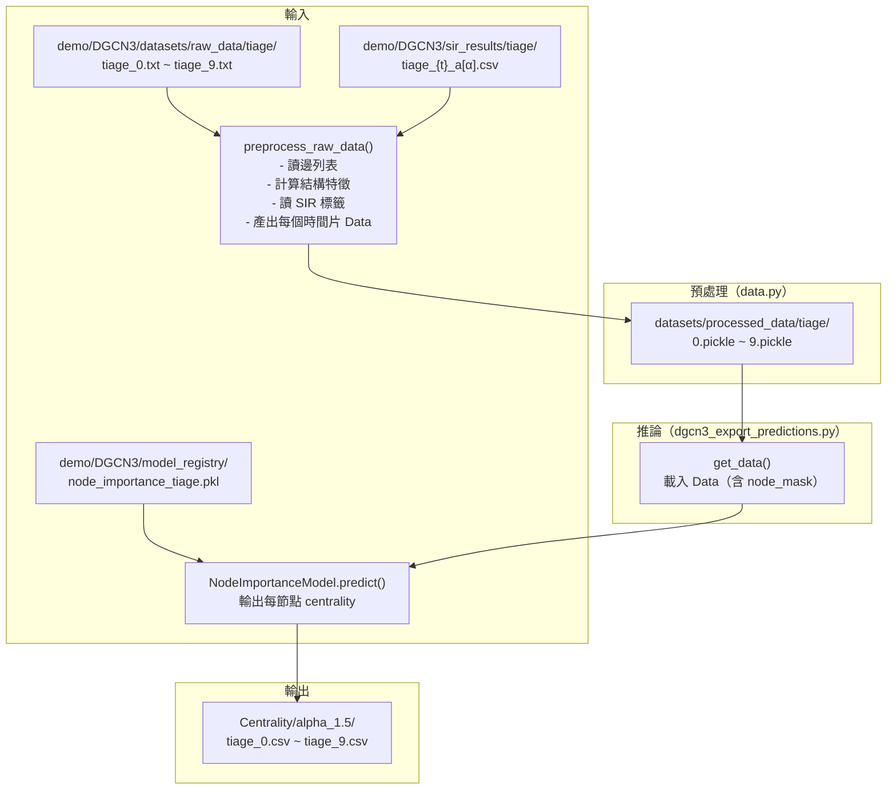
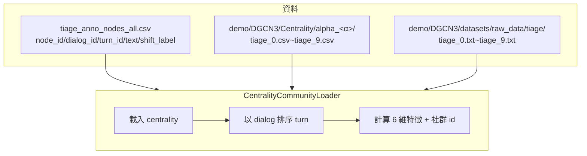
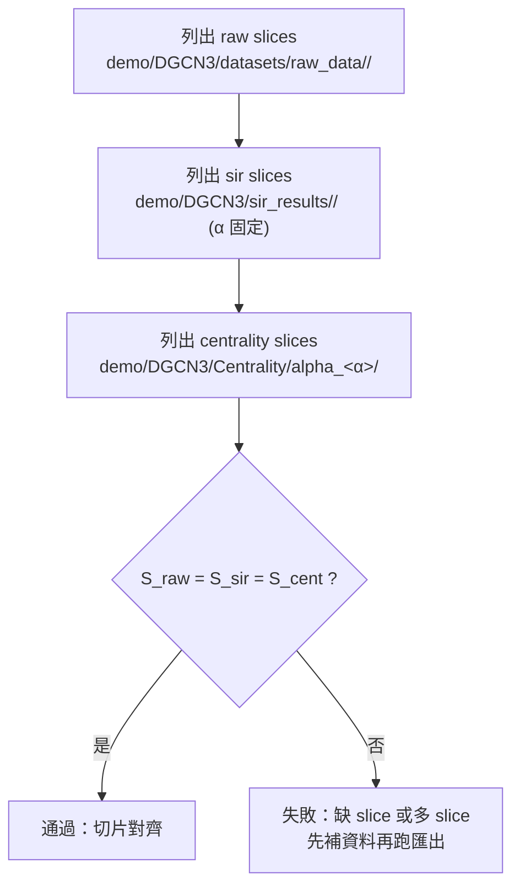

# DGCN3（tiage）中心性輸入/輸出規格與換資料集說明

> 目的：把「DGCN3 以 `tiage` 為輸入、以 `sir_results/tiage` 為真實標籤、輸出 `Centrality/alpha_1.5` 中心性」這個模糊需求，整理成**可交付給他人審閱**的工程規格文件（含輸入/輸出契約、實際程式流程、需要修改/替換的檔案、mermaid 流程圖、驗收標準、換資料集清單）。

最後更新：2026-01-05  
適用範圍：本倉庫 `demo/DGCN3/`（DGCN3 節點重要性模型）與其在 TAKE 管線中的中心性特徵整合

---

## 一、需求重述

我理解的需求是：

- **目標**：只處理 `tiage` 這個資料集，依據動態網路每個時間切片（time slice）輸出每個節點的中心性（node importance / centrality）分數。
- **輸入（圖資料）**：`demo/DGCN3/datasets/raw_data/tiage/`  
  - 內含多個時間切片的邊列表檔（例如 `tiage_0.txt` ~ `tiage_9.txt`）。
- **輸入（真實標籤）**：`demo/DGCN3/sir_results/tiage/`  
  - 以 SIR 模擬結果作為標籤，檔名規則包含時間切片 `t` 與參數 `a[α]`（例如 `tiage_0_a[1.5].csv`）。
  - 備註：`0` 是時間切片；`a[1.0]`/`a[1.5]` 中的 `a[...]` 是一個可循環測試的參數（本文先以 `α=1.5` 驗證）。
- **輸出（中心性）**：`demo/DGCN3/Centrality/alpha_1.5/`  
  - 輸出每個時間切片一個檔案（例如 `tiage_0.csv` ~ `tiage_9.csv`），內容為 `(node_id, centrality)`。
- **補充資料（節點對應文本/標籤）**：`demo/tiage-1/outputs_nodes/tiage_anno_nodes_all.csv`  
  - 保存**所有節點**對應的文本與話題轉移標籤，用於與中心性做對齊（並在 TAKE 系統中用來計算 6 維結構特徵）。
- **換新資料集時**：至少需要替換三個「資料依賴」：
  1) `demo/DGCN3/datasets/raw_data/<dataset>`（時間切片邊列表）  
  2) `demo/DGCN3/sir_results/<dataset>`（SIR 真實標籤）  
  3) `demo/<dataset>-1/outputs_nodes/<dataset>_anno_nodes_all.csv`（節點→文本/標籤映射）  
  中心性可以由程式重新計算（輸出目錄可重新產生）。

---

## 二、現有系統（實作現況）總覽

本倉庫中，中心性是由 **DGCN3 節點重要性模型**推論得到，並被 TAKE 系統作為額外結構特徵使用。

### 2.1 DGCN3「中心性匯出」實際入口與路徑

- **建議操作入口（走腳本）**：`scripts/run_export_centrality_tiage.sh`
- 腳本底層呼叫：`main.py export-centrality --dataset-name tiage --alphas 1.5`
- `main.py export-centrality` 會執行：`dgcn3_export_predictions.py`
- `dgcn3_export_predictions.py` 會切換工作目錄到 `demo/DGCN3/`，並使用 `demo/DGCN3/data.py:get_data()` 載入資料、載入模型、對每個時間切片輸出預測。

### 2.2 資料流（DGCN3 匯出中心性）



### 2.3 DGCN3 演算法（高層摘要）

（此段為理解整體流程用；若只關心輸入/輸出，可略過。）

- **特徵抽取（每個時間切片）**：由邊列表構圖（NetworkX），計算：
  - 全圖度特徵 D1~D3
  - 社群內度特徵 D1~D3（Louvain 社群偵測）
  - 全圖 H-index 特徵 H1~H3
  - 社群內 H-index 特徵 H1~H3  
  最終拼接成 12 維結構特徵（不含 one-hot）。
- **監督標籤（每個時間切片）**：讀取對應的 SIR 結果 CSV（欄位 `Node`、`SIR`），組成 `y`。
- **模型（NodeImportanceModel）**：GAT/MPNN 編碼 + 預測頭（並含對比學習設計）；推論輸出每個節點的「重要性/中心性」分數。

---

## 三、資料契約（輸入/輸出格式）— 必須嚴格對齊

### 3.1 動態圖時間切片（raw_data/tiage）

- **路徑**：`demo/DGCN3/datasets/raw_data/tiage/`
- **檔名規則（必要）**：需能以 `_{t}.txt` 解析出時間切片 `t`  
  - 目前程式排序邏輯：`int(filename.split('_')[1].split('.txt')[0])`
- 建議命名：`<dataset>_0.txt, <dataset>_1.txt, ...`（本文件以 `tiage_0.txt ~ tiage_9.txt` 示範）
- **檔案內容格式（必要）**：
  - 每行至少兩個整數 `u v`，以空白分隔（空白或 tab 均可）
  - 代表一條邊（無向圖）；自迴圈（`u==v`）會被忽略

範例：

```text
12 35
35 80
80 12
```

### 3.2 真實標籤（sir_results/tiage）

- **路徑**：`demo/DGCN3/sir_results/tiage/`
- **檔名規則（必要）**：`<dataset>_{t}_a[{α}].csv`  
  - 例如（tiage）：`tiage_0_a[1.5].csv`
- **CSV 欄位（必要）**：
  - `Node`：節點 ID（整數）
  - `SIR`：SIR 值（浮點數）

範例（概念）：

```csv
Node,SIR
0,0.123
1,0.045
```

重要注意事項：

- **即使只做推論輸出中心性，目前資料載入仍強制讀取 SIR 標籤檔**。也就是說，`demo/DGCN3/sir_results/tiage/` 必須完整存在，否則會直接拋出 `FileNotFoundError`。
- `α`（在檔名中寫作 `a[α]`）是用來索引標籤檔的關鍵參數；若你要測多個 `α`，每個 `α` 都需要對應一組完整的 `tiage_{t}_a[α].csv`。

補充（依目前 `demo/` 實際資料）：

- `demo/DGCN3/datasets/raw_data/tiage/`：共有 **10 個時間切片**（`tiage_0.txt ~ tiage_9.txt`）
- `demo/DGCN3/sir_results/tiage/`：共有 **100 個 CSV**，對應 **10 個切片 × 10 個 α**（目前可見 `α=1.0~1.9`）

### 3.3 節點→文本/標籤映射（tiage_anno_nodes_all.csv）

此檔案是你特別指出「用來描述每個 node 對應文本與標籤」的核心資料，且在 TAKE 系統中會被用來計算 6 維結構特徵（以對話為單位排序 turn）。

- **路徑**：`demo/tiage-1/outputs_nodes/tiage_anno_nodes_all.csv`
- **目前已存在的欄位**（實際檔案表頭）：
  - `node_id`（整數）
  - `split`（train/test）
  - `dialog_id`（整數）
  - `turn_id`（整數）
  - `text`（字串）
  - `shift_label`（-1/0/1）

### 3.4 中心性輸出（Centrality/alpha_{α}）

- **輸出根目錄**：`demo/DGCN3/Centrality/`
- **輸出子目錄**：`alpha_{α}`（例如 `alpha_1.5`）
- **檔名**：`<dataset>_{t}.csv`（本文件以 `tiage_{t}.csv` 示範）
- **檔案內容格式**：
  - 兩欄、以逗號分隔：`node_id,centrality`
  - **無表頭**

範例（實際檔案格式）：

```text
0,-2.598853
1,-3.356948
16,-3.120459
```

補充：輸出只會包含該時間切片中 `node_mask=True` 的節點（也就是該切片邊列表中實際出現過的節點）。  
因此**中心性輸出不一定覆蓋 `tiage_anno_nodes_all.csv` 的所有 node**；未覆蓋的節點在後續使用時會被視為 `centrality=0.0`（由載入器補 0）。

---

## 四、與現有 TAKE 系統的關聯（為什麼需要 tiage_anno_nodes_all.csv）

若你的下游是 TAKE（話題轉移檢測/知識選擇），中心性 CSV 會被載入並轉換成 6 維結構特徵，再與 BERT 文本向量融合。

### 4.1 TAKE 結構特徵載入器（CentralityCommunityLoader）

- 實作位置：`knowSelect/TAKE/CentralityLoader.py`
- 它會：
  1) 讀 `demo/tiage-1/outputs_nodes/tiage_anno_nodes_all.csv`
  2) 讀 `demo/DGCN3/Centrality/alpha_1.5/tiage_{slice}.csv`
  3) 讀 `demo/DGCN3/datasets/raw_data/tiage/tiage_{slice}.txt` 做 Louvain 社群偵測
  4) 以 `dialog_id` 分組、依 `turn_id` 排序，為每個 `node_id` 計算 6 維特徵（詳見 `docs/ALGORITHM_ARCHITECTURE.md`）



---

## 五、僅處理 tiage 的操作方式（建議）

> 為符合工程治理：請以 `scripts/*.sh` 作為啟動入口；下方同時列出底層程式鏈路僅供理解。

### 5.1 前置條件（你需要準備的檔案）

- `demo/DGCN3/model_registry/node_importance_tiage.pkl`（DGCN3 模型權重；目錄在 DGCN3 `.gitignore` 中，需自行放置）
- `demo/DGCN3/datasets/raw_data/tiage/tiage_0.txt ~ tiage_9.txt`
- `demo/DGCN3/sir_results/tiage/tiage_{t}_a[α].csv`（每個時間片都要有；要測哪些 α 就需要哪些 α 的檔案，先用 1.5 驗證也可）

### 5.2 執行（中心性匯出）

快速驗證（α=1.5）：

```bash
./scripts/run_export_centrality_tiage.sh
```

多 α 循環（共存輸出到 `Centrality/alpha_<α>/...`）：

- 直接修改 `scripts/run_export_centrality_tiage.sh` 內的 `--alphas` 為逗號分隔清單，例如：
  - `--alphas 1.0,1.1,1.2,1.3,1.4,1.5,1.6,1.7,1.8,1.9`

底層實際做的事（僅供理解）：

- `main.py export-centrality --dataset-name tiage --alphas <comma-separated>`
- 呼叫 `dgcn3_export_predictions.py`，對每個 α 輸出到 `demo/DGCN3/Centrality/alpha_<α>/`

### 5.3 驗收（快速檢查點）

- **α=1.5（快速驗證）**：`demo/DGCN3/Centrality/alpha_1.5/` 下應有 `tiage_0.csv ~ tiage_9.csv`
- **多 α（循環輸出）**：對每個 α，都應存在 `demo/DGCN3/Centrality/alpha_<α>/tiage_0.csv ~ tiage_9.csv`
- **檔案格式**：每行兩欄、無表頭：`node_id,centrality`
- **節點重複性（建議）**：跨時間片的 `node_id` 應無重複（避免後續特徵載入被覆蓋）  
  - 本倉庫已提供的範例輸出檢查結果：`tiage_0~9.csv` 之間 **node_id 無重複**（此點對資料對齊非常關鍵）
- **覆蓋率（可接受）**：中心性輸出可能不覆蓋所有節點；缺失節點會在 TAKE 特徵載入時補 0

---

## 六、換新資料集：需要替換什麼、可能需要修改什麼

### 6.1 必換的三個資料依賴（你原始描述的重點）

| 類別 | 你提供/我要放置的位置 | 目的 |
|---|---|---|
| 時間切片邊列表 | `demo/DGCN3/datasets/raw_data/<dataset>/` | 定義每個時間片的圖結構 |
| SIR 真實標籤 | `demo/DGCN3/sir_results/<dataset>/` | 作為 DGCN3 資料載入時的 `y`（目前必需） |
| 節點映射（文本/標籤） | `demo/<dataset>-1/outputs_nodes/<dataset>_anno_nodes_all.csv` | 讓下游能把 `node_id` 對齊到文本/標籤（TAKE 也依賴它算 6 維特徵） |

此外還有一個**常被忽略但實際必需**的依賴：

- `demo/DGCN3/model_registry/node_importance_<dataset>.pkl`（對應資料集的模型檔；若沒有，無法推論輸出中心性）

### 6.2 需要朋友特別確認的關鍵點（因為程式有 tiage 前綴硬編碼）

目前系統中有多處把檔名寫死為 `tiage_{slice}`：

- `knowSelect/TAKE/CentralityLoader.py`：讀取中心性與邊列表時固定使用 `tiage_{slice}.csv` 與 `tiage_{slice}.txt`
- `dgcn3_export_predictions.py`：輸出中心性時固定輸出 `tiage_{t}.csv`

你已確認要採用 **做法 B（可維護）**：統一命名規則為 `<dataset>_*.{txt,csv}`，並讓程式全面支援 `<dataset>` 前綴（不再硬編碼 `tiage_...`）。

需要補上的程式修改點（最小改動、可回滾）：

- **`dgcn3_export_predictions.py`**
  - **現況**：固定輸出 `tiage_{t}.csv`
  - **目標**：輸出 `<dataset>_{t}.csv`（其中 `<dataset>` 取自 `--dataset_name`）
- **`knowSelect/TAKE/CentralityLoader.py`**
  - **現況**：固定讀取 `tiage_{slice}.csv`、`tiage_{slice}.txt`
  - **目標**：讀取 `<dataset>_{slice}.csv`、`<dataset>_{slice}.txt`（其中 `<dataset>` 與 TAKE 參數 `--dataset` 一致）
  - **建議做法**：在 `CentralityCommunityLoader.__init__()` 新增 `dataset_prefix: str`（預設 `tiage`），並在 `_load_centrality_for_slice()` / `_load_community_for_slice()` 統一使用該前綴
- **`scripts/*.sh`**
  - **現況**：`scripts/run_export_centrality_tiage.sh` 固定 `--dataset-name tiage`
  - **目標**：提供可設定 dataset 與 `--alphas`（多 α）的方法（可用環境變數或新增一支泛用腳本）

---

## 七、驗收標準（Definition of Done）

以「只處理 tiage、對多個 α 做循環」為準，滿足以下即視為完成：

- 對每個 α，都在 `demo/DGCN3/Centrality/alpha_<α>/` 成功產生 `tiage_0.csv ~ tiage_9.csv`
- 每個輸出檔符合格式：**無表頭**，每行 `node_id,centrality`
- `demo/DGCN3/sir_results/tiage/tiage_{t}_a[α].csv` 對每個 `t` 都存在（否則匯出會失敗）
- （若下游走 TAKE）`knowSelect/TAKE/CentralityLoader.py` 能夠在不報錯的情況下讀入中心性與邊列表，並為 batch 產生 6 維特徵

---

## 八、關鍵決策（已確認）與時間切片策略（推薦）

### 8.1 已確認決策

1. **中心性定義**：中心性 = **DGCN3 模型對 SIR 重要性的預測值**（不是直接使用真實 SIR）
2. **α 參數策略**：對 **多個 α 做循環測試**，並共存輸出（`Centrality/alpha_<α>/...`）
3. **換新資料集命名規範**：採用 `<dataset>_*.{csv,txt}`，並修改程式移除 `tiage_...` 硬編碼

### 8.2 時間切片策略（最適合做法：以 DGCN3 的 raw_data 為權威來源）

#### 結論（直接可用）

- **本流程（DGCN3 → Centrality → TAKE CentralityLoader）以 `demo/DGCN3/datasets/raw_data/<dataset>/` 的檔案清單為「時間切片權威來源」**。  
  因為：
  - DGCN3 的資料載入（`demo/DGCN3/data.py:get_data()`）讀的是這個目錄
  - TAKE 的 `CentralityCommunityLoader` 做社群偵測也讀的是這個目錄
- 依目前 `demo/` 現況：`demo/DGCN3/datasets/raw_data/tiage/` 只有 `tiage_0.txt ~ tiage_9.txt`，因此 **tiage 在本流程中定義為 10 個切片（0~9）**。

#### `demo/tiage-1/tiage_slices_txt/tiage_10.txt` 的定位（避免誤用）

`demo/tiage-1/tiage_slices_txt/` 是由 `demo/tiage-1/main.py` 產生的「空間網路」切片邊列表（kNN + MST + MST 補邊後再切片）。  
該腳本目前以 `num_slices=10` 生成切片，因此理論上只會產生 `tiage_0.txt ~ tiage_9.txt`；目錄中出現的 `tiage_10.txt` 更像是**歷史殘留檔**（例如曾用不同參數生成後未清理），且 **並未被 DGCN3 / Centrality 流程使用**。

> 推薦：把 `demo/tiage-1/tiage_slices_txt/` 視為「可視化/分析用資料」，不要把其中的 `tiage_10.txt` 直接當成 DGCN3 的 slice=10 輸入，除非你要做「整套切片數擴充」並補齊所有相依資料（見下節）。

#### 時間切片一致性檢查（建議寫入驗收）

對於某個 dataset 與某個 α，至少要滿足：

- `demo/DGCN3/datasets/raw_data/<dataset>/` 的切片集合 = `S_raw`
- `demo/DGCN3/sir_results/<dataset>/` 存在 `<dataset>_{t}_a[α].csv` 的切片集合 = `S_sir`
- `demo/DGCN3/Centrality/alpha_<α>/` 存在 `<dataset>_{t}.csv` 的切片集合 = `S_cent`

推薦驗收條件：

- \(S_{raw} = S_{sir} = S_{cent}\)



### 8.3 若你「確定」要把 slice=10 納入 DGCN3 / Centrality（完整清單）

> 這不是「加一個檔案」而已；你必須確保 **raw / sir / centrality / 下游參數**整套一致，且不混用不同來源的切片邊列表。

#### Step 0：先決定 slice=10 的 raw 邊列表來源（避免混用）

目前你同時有兩套邊列表來源：

- **DGCN3 來源**：`demo/DGCN3/datasets/raw_data/tiage/tiage_*.txt`
- **tiage-1 來源**：`demo/tiage-1/tiage_slices_txt/tiage_*.txt`（由 `demo/tiage-1/main.py` 生成）

兩者即使同名（例如 `tiage_0.txt`），內容規模也可能不同（邊數差異很大），因此**不建議只把 `tiage_10.txt` 從 tiage-1 來源「單獨拷貝」到 DGCN3 來源**。  
推薦做法是：**選定一個生成邏輯，並用同一邏輯把 0~10 全部切片都生成出來**，再放到 `demo/DGCN3/datasets/raw_data/tiage/`。

#### Step 1：補齊 DGCN3 raw_data 的 slice=10

- 需要存在：`demo/DGCN3/datasets/raw_data/tiage/tiage_10.txt`

#### Step 2：補齊 SIR 標籤（所有 α）

對每個要測試的 α，都需要存在：

- `demo/DGCN3/sir_results/tiage/tiage_10_a[α].csv`

（目前 `demo/DGCN3/sir_results/tiage/` 未出現任何 `tiage_10_a[*].csv`，因此 **現況下無法把 slice=10 納入 DGCN3 資料載入與中心性匯出**。）

#### Step 3：重新匯出中心性（所有 α）

對每個 α，應產生：

- `demo/DGCN3/Centrality/alpha_<α>/tiage_10.csv`

#### Step 4：同步下游切片數（或改為自動偵測）

目前下游預設切片數寫死為 `10`：

- `knowSelect/TAKE/CentralityLoader.py`：`num_slices: int = 10`
- `knowSelect/TAKE/Run.py`：建 loader 時預設 `num_slices=10`

若擴充為 0~10（共 11 個切片），你需要：

- 把 `num_slices` 調整為 `11`，或
- **更推薦**：改成「由 `demo/DGCN3/datasets/raw_data/<dataset>/` 自動掃描出切片集合」再迴圈載入（避免之後再遇到 10/11/… 不一致）

