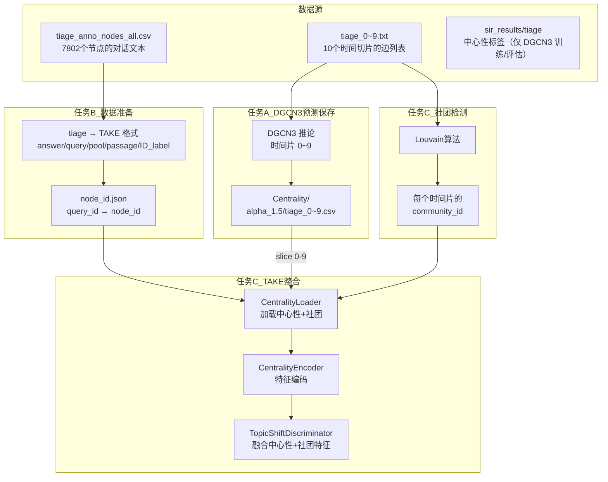
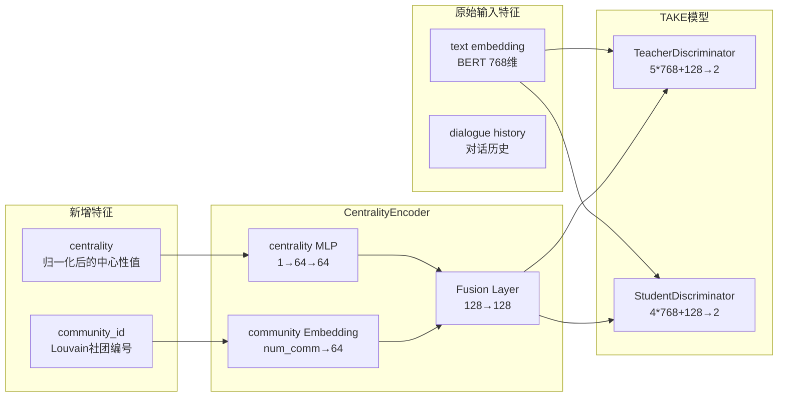

# DGCN3 中心性预测与 TAKE 话题转移判别整合计划

> 本文档描述如何将 DGCN3 的节点中心性预测与 TAKE 的话题转移判别模型进行整合  
> **范围限定：仅处理 tiage 数据集，且 TAKE 需要先完成 tiage → TAKE 数据格式转换**

---

## 目录

1. [项目背景](#一项目背景)
2. [整体数据流程](#二整体数据流程)
3. [任务 A：保存 DGCN3 预测结果](#三任务-a保存-dgcn3-预测结果)
4. [任务 B：tiage → TAKE 数据准备](#四任务-btiage--take-数据准备)
5. [任务 C：整合 TAKE 话题转移判别](#五任务-c整合-take-话题转移判别)
6. [训练脚本](#六训练脚本)
7. [注意事项与依赖](#七注意事项与依赖)
8. [文件修改清单](#八文件修改清单)
9. [预期输出](#九预期输出)

---

## 一、项目背景

### 1.1 三个项目关系

| 项目 | 路径 | 用途 | 状态 |
|------|------|------|------|
| **DGCN3** | `demo/DGCN3/` | 动态网络节点中心性预测（GAT-based） | 已训练，需保存预测 |
| **TAKE** | `knowSelect/TAKE/` | 话题转移感知的知识选择 | 需整合中心性+社团 |
| **tiage-1** | `demo/tiage-1/` | 文本数据集转时间切片网络 | 数据源 |

补充说明：
- 当前仓库的 `knowSelect/datasets/` 中没有可直接训练的 tiage 数据文件，需先生成 TAKE 格式的数据文件。

### 1.2 DGCN3 模型架构

```
原始图数据 (x, edge_index)
    ↓
MPNN 编码器 (3层GAT)
    ↓
节点嵌入 z [N, output_dim]
    ↓
重要性预测器 (全连接层)
    ↓
预测分数 y_pred [N] ← 中心性预测结果
```

- 训练数据：时间片 0-6（70%）
- 测试数据：时间片 7, 8, 9（30%）
- 输出：每个节点的 SIR 传播重要性分数

### 1.3 TAKE 模型架构

```
知识选择模块：
├── TopicShiftedSelector：基于当前上下文选择知识
├── TopicInheritedSelector：基于对话历史选择知识
└── TopicShiftDiscriminator：判断话题是否转移
    ├── TeacherDiscriminator：使用 gold knowledge（训练）
    └── StudentDiscriminator：不使用 gold knowledge（推论）
```

### 1.4 数据映射关系

**tiage 数据集结构**：
- 总节点数：7,802
- 总对话数：300
- 对话长度：14-26 turns

**node_id 生成规则**：
- 原始顺序为 train → dev → test（0~7801）
- 本项目训练/测试以时间片划分（slice 0~6 训练，7~9 测试），不使用 dev

**节点编号对齐注意**：
- `demo/DGCN3/datasets/raw_data/tiage/tiage_*.txt` 的节点编号来自 `tiage-1` 的构图结果
- 需要确保该编号与 `tiage_anno_nodes_all.csv` 的 `node_id` 一致（默认情况下 row_id == node_id）
- 若后续对 `tiage_anno_nodes_all.csv` 做过滤/重排，请先做一次对齐校验

**时间切片计算**：
```python
slice_id = floor(10 * turn_id / dialog_len)
# 每个对话独立计算，与绝对位置无关
```

**各切片节点分布**：
| Slice | 节点数 | 占比 |
|-------|--------|------|
| 0 | 1,002 | 12.8% |
| 1 | 950 | 12.2% |
| 2 | 566 | 7.3% |
| 3 | 950 | 12.2% |
| 4 | 504 | 6.5% |
| 5 | 1,002 | 12.8% |
| 6 | 950 | 12.2% |
| 7 | 565 | 7.2% |
| 8 | 879 | 11.3% |
| 9 | 434 | 5.6% |

---

## 二、整体数据流程



### 中心性数据来源

| 时间片 | 数据来源 | 路径 |
|--------|----------|------|
| 0-9（训练/验证/测试一致） | DGCN3 预测 | `demo/DGCN3/Centrality/alpha_1.5/tiage_Y.csv` |

说明：
- DGCN3 推论需要覆盖所有时间片（0~9），确保训练/测试使用同一来源的中心性特征
- 预测保存时只输出该时间片 `node_mask == True` 的节点
- 先以 `alpha=1.5` 试跑，确认流程无误后再扩展 alpha 列表

---

## 三、任务 A：保存 DGCN3 预测结果

### 3.1 目标

- 新建 `demo/DGCN3/Centrality/` 目录
- 仅处理 **tiage** 数据集
- 先以 `alpha=1.5` 生成预测结果（确认流程后再扩展 alpha 列表）
- 每个时间片 (0-9) 一个 CSV 文件
- 格式：`节点ID,预测中心性`（无列名）
- 只输出该时间片实际存在的节点（`node_mask == True`）

### 3.2 输出目录结构

```
demo/DGCN3/Centrality/
└── alpha_1.5/
    ├── tiage_0.csv
    ├── tiage_1.csv
    ├── ...
    └── tiage_9.csv
```

若需要遍历多个 alpha，可在确认流程无误后扩展为：
`alpha_1.0 ~ alpha_1.9` 的子目录结构。

### 3.3 CSV 格式示例

```csv
0,0.8234
741,0.5621
1741,0.3412
4764,0.7891
...
```
- 第一列：节点 ID
- 第二列：预测的中心性值
- 无表头

### 3.4 代码修改：`demo/DGCN3/main.py`

#### 新增函数（在 `inference` 函数后，约 150 行位置）

```python
def save_centrality_predictions(
    probs: List[torch.Tensor],
    timesteps: List[int],
    dataset: List[Data],
    alpha: float,
    output_base_dir: str = None
) -> None:
    """
    保存 DGCN3 预测结果到 CSV 文件

    Args:
        probs: 每个时间步的预测张量列表
        timesteps: 时间步列表 (0~9)
        alpha: 当前 alpha 参数值
        output_base_dir: 输出基础目录
    """
    import pandas as pd
    import numpy as np

    if output_base_dir is None:
        output_base_dir = os.path.join(os.path.dirname(__file__), "Centrality")

    # 创建 alpha 子目录
    alpha_dir = os.path.join(output_base_dir, f"alpha_{alpha}")
    os.makedirs(alpha_dir, exist_ok=True)

    for pred, t in zip(probs, timesteps):
        mask = dataset[t].node_mask.cpu().numpy()
        node_ids = np.where(mask)[0]
        predictions = pred.numpy()[mask]

        # 创建 DataFrame（仅输出该时间片存在的节点）
        df = pd.DataFrame({
            'node_id': node_ids,
            'centrality': predictions
        })

        # 保存 CSV（无表头）
        output_path = os.path.join(alpha_dir, f"tiage_{t}.csv")
        df.to_csv(output_path, index=False, header=False)
        print(f"[*] Saved centrality predictions to {output_path}")
```

备注：
- 若 `inference()` 只返回测试时间片，请改为返回全时间片预测结果（0~9），避免训练/测试特征来源不一致。

#### 修改 `main()` 函数（约 233 行，在评估后添加）

```python
# 在 test_results = evaluate(...) 之后添加：
# 建议让 inference 返回 (probs, timesteps)，覆盖 0~9
save_centrality_predictions(
    probs=probs,
    timesteps=timesteps,
    dataset=dataset,
    alpha=a_list[i],
    output_base_dir=os.path.join(os.path.dirname(__file__), "Centrality")
)
```

---

## 四、任务 B：tiage → TAKE 数据准备

### 4.1 为什么必须做

TAKE 的数据读取逻辑依赖以下文件（位于 `knowSelect/datasets/{dataset}/`）：
- `{dataset}.answer`
- `{dataset}.query`
- `{dataset}.pool`
- `{dataset}.passage`
- `{dataset}.split`
- `ID_label.json`

当前仓库中仅有 `ID_label.json` 的示例文件，因此要在 TAKE 上跑 tiage，必须先把 `tiage_anno_nodes_all.csv` 转成上述格式。

### 4.2 输出目录与文件

建议输出到：
```
knowSelect/datasets/tiage/
```

并生成：
```
tiage.answer
tiage.query
tiage.pool
tiage.passage
tiage.split
ID_label.json
node_id.json         # 新增：query_id → node_id
```

### 4.3 建议的映射规则（最小可跑版本）

- `query_id`：使用 `dialog_id_turn_id` 作为唯一 ID（例如 `12_3`）
- `all_previous_query_id`：同一对话内的历史 `query_id` 列表（按时间顺序）
- `response_content`：使用当前 turn 的文本（先确保能跑通）
- `ID_label.json`：直接用 `shift_label`（-1/0/1）  
  - 1 表示话题转移，0 表示非转移  
  - -1 可视作对话开头，模型训练中会被 `ignore_index=-1` 忽略
- `tiage.split`：每行 `query_id<TAB>train|test`，按时间片划分（slice 0~6 为 train，7~9 为 test）

`tiage.answer` 每行格式（与现有解析逻辑一致）：
```
all_previous_query_ids<TAB>current_query_id<TAB>background_id_list<TAB>response_text
```

**知识池（pool/passage）两种方案：**
1. **最小版本（建议先跑通）**  
   每个 turn 的 knowledge pool 只包含自己：  
   - `background_id` = `query_id`  
   - `passage` = 当前 turn 文本  
   - `knowledge_label` = `background_id`  
2. **图结构版本（更贴近论文）**  
   用 `demo/DGCN3/datasets/raw_data/tiage/tiage_{slice}.txt` 中的邻居节点构建 pool，  
   `passage` 用邻居对应的文本，`knowledge_label` 需另行定义（需你确认策略）。

### 4.4 需要你确认的问题

已确认：
- `shift_label = 1` 表示话题转移，`0` 表示非转移。
- 仅划分 train/test（不使用 dev），按构图时的时间片划分：0~6 为训练，7~9 为测试。
  - 网络中一个节点对应一句话，10 个时间片与 DGCN3 一致。
- knowledge pool 与 gold knowledge 暂维持“最小可跑版本”（每个 turn 仅自身）。

---

## 五、任务 C：整合 TAKE 话题转移判别

本阶段先只把中心性/社团特征注入 **话题转移判别器**，知识选择模块保持原样。  
如需进一步让知识选择也使用中心性，可后续再扩展。

### 5.1 特征整合架构



### 5.1.1 结构特征列表（论文版）

以下 6 个特征将作为结构特征输入话题转移判别器，用于论文报告与消融实验：

1. `imp_raw`: 原始重要性分数（DGCN3 预测）
2. `imp_pct`: 重要性分位数（排名特征，0~1）
3. `imp_delta_prev`: 与上一句的分位数变化（imp_pct[t] - imp_pct[t-1]）
4. `imp_delta_next`: 与下一句的分位数变化（imp_pct[t+1] - imp_pct[t]）
5. `imp_z_local`: 局部窗口 z-score
6. `imp_minus_window_mean`: 与局部窗口均值差

推荐默认实现（便于复现）：
- `imp_pct` 在同一对话内计算（按 `turn_id` 排序的 ranking）
- 局部窗口 `t±2`，窗口大小可配置（`--centrality_window`）
- 边界位置（第一句/最后一句）缺失的 delta 设为 0
- z-score 分母使用 `std + 1e-6` 避免除零

### 5.1.2 特征计算流程（与节点中心性解耦）

1. 读取 DGCN3 输出的 `imp_raw`（全部 slice 0~9）
2. 用 `node_mapping_csv` 的 `dialog_id/turn_id` 将节点按对话排序
3. 在每个对话内计算 `imp_pct`、delta、local z/diff
4. 生成 `node_id -> [6维特征]` 的映射
5. 训练/推论时按 `node_ids` 索引该映射

可选缓存（推荐）：
```
knowSelect/datasets/tiage/centrality_features_alpha1.5.npy
```
避免每次训练重复计算。

### 5.1.3 消融实验设置（必须输出表格）

- A1: 纯文本（不使用结构特征）
- A2: 文本 + `imp_pct`
- A3: 文本 + 全部结构特征（6 维）

每组都输出 shift 评价指标（Precision / Recall / F1）。

### 5.2 新增文件 1：`knowSelect/TAKE/CentralityLoader.py`

**功能**：加载中心性和社团特征  
**输入**：每个样本的 `node_id`（来自 4.2 的 `node_id.json`）

```python
"""
Centrality and Community Feature Loader for TAKE model.
"""
import os
import pandas as pd
import numpy as np
import torch
import networkx as nx
import community as community_louvain
from typing import Dict, Tuple
from sklearn.preprocessing import MinMaxScaler


class CentralityCommunityLoader:
    """
    加载中心性和社团特征

    - 全部时间片：使用 DGCN3 预测（训练/测试一致）
    - 同步生成 6 维结构特征（imp_raw/imp_pct/imp_delta/imp_z/...）
    """

    def __init__(
        self,
        dgcn_predictions_dir: str,      # Centrality
        edge_lists_dir: str,            # datasets/raw_data/tiage
        node_mapping_csv: str,          # tiage_anno_nodes_all.csv
        alpha: float = 1.5,
        num_slices: int = 10,
        feature_set: str = "all",       # none | imp_pct | all
        window_size: int = 2
    ):
        self.dgcn_predictions_dir = dgcn_predictions_dir
        self.edge_lists_dir = edge_lists_dir
        self.alpha = alpha
        self.num_slices = num_slices
        self.feature_set = feature_set
        self.window_size = window_size

        # 加载节点映射
        self.node_df = pd.read_csv(node_mapping_csv)
        self._build_node_to_slice_mapping()

        # 加载特征
        self.centrality_dict = {}
        self.community_dict = {}
        self.feature_dict = {}
        self._load_all_features()

    def _build_node_to_slice_mapping(self):
        """构建 node_id → slice_id 映射"""
        dialog_lens = self.node_df.groupby('dialog_id')['turn_id'].max() + 1
        self.node_df['dialog_len'] = self.node_df['dialog_id'].map(dialog_lens)
        self.node_df['slice_id'] = (
            self.num_slices * self.node_df['turn_id'] / self.node_df['dialog_len']
        ).astype(int).clip(0, self.num_slices - 1)
        self.node_to_slice = dict(zip(
            self.node_df['node_id'],
            self.node_df['slice_id']
        ))

    def _load_centrality_for_slice(self, slice_id: int) -> Dict[int, float]:
        """加载指定时间片的中心性值"""
        centrality = {}

        # 全部使用 DGCN3 预测
        pred_file = os.path.join(
            self.dgcn_predictions_dir,
            f"alpha_{self.alpha}",
            f"tiage_{slice_id}.csv"
        )
        if os.path.exists(pred_file):
            df = pd.read_csv(pred_file, header=None,
                           names=['node_id', 'centrality'])
            for _, row in df.iterrows():
                centrality[int(row['node_id'])] = float(row['centrality'])

        return centrality

    def _load_community_for_slice(self, slice_id: int) -> Dict[int, int]:
        """使用 Louvain 算法计算社团"""
        edge_file = os.path.join(self.edge_lists_dir, f"tiage_{slice_id}.txt")

        if not os.path.exists(edge_file):
            return {}

        # 构建图
        G = nx.Graph()
        with open(edge_file, 'r') as f:
            for line in f:
                parts = line.strip().split()
                if len(parts) >= 2:
                    u, v = int(parts[0]), int(parts[1])
                    G.add_edge(u, v)

        # Louvain 社团检测
        partition = community_louvain.best_partition(G)
        return partition

    def _load_all_features(self):
        """加载所有特征"""
        for slice_id in range(self.num_slices):
            centrality = self._load_centrality_for_slice(slice_id)
            community = self._load_community_for_slice(slice_id)
            self.centrality_dict.update(centrality)
            self.community_dict.update(community)

        # 生成 6 维结构特征（按对话计算）
        self.feature_dict = self._build_feature_dict()

    def get_num_communities(self) -> int:
        """获取社团总数"""
        if not self.community_dict:
            return 0
        return max(self.community_dict.values()) + 1

    def get_features_for_node(self, node_id: int) -> Tuple[np.ndarray, int]:
        """获取单个节点的特征"""
        features = self.feature_dict.get(node_id, np.zeros(6, dtype=np.float32))
        community = self.community_dict.get(node_id, 0)
        return features, community

    def get_batch_features(
        self,
        node_ids: torch.Tensor,
        device: torch.device
    ) -> Tuple[torch.Tensor, torch.Tensor]:
        """获取批量节点的特征"""
        batch_size = node_ids.size(0)
        features = torch.zeros(batch_size, 6, device=device)
        communities = torch.zeros(batch_size, dtype=torch.long, device=device)

        for i, nid in enumerate(node_ids.tolist()):
            feat, comm = self.get_features_for_node(nid)
            features[i] = torch.tensor(feat, device=device)
            communities[i] = comm

        return features, communities
```

建议（可选优化）：
- 将 `centrality_dict`/`community_dict` 预先展开为定长数组（`num_nodes`），
  再用 `node_ids` 直接索引，可避免 Python 循环。
- `node_mapping_csv` 主要用于构建 node_id → slice_id 的一致性校验；若不需要可移除。
- 若训练频繁，建议将 `feature_dict` 缓存为 `.npy` 后直接加载。

`_build_feature_dict()` 需要完成：
- 以 `node_df` 的 `dialog_id/turn_id` 为序列单位
- 使用 `imp_raw` 计算 `imp_pct`/delta/z/diff
- 按 `feature_set` 过滤（`none`/`imp_pct`/`all`）

### 5.3 新增文件 2：`knowSelect/TAKE/CentralityEncoder.py`

**功能**：将中心性和社团编码为密集向量

```python
"""
Neural network modules for encoding centrality and community features.
"""
import torch
import torch.nn as nn


class CentralityCommunityEncoder(nn.Module):
    """
    将中心性和社团特征编码为密集表示

    架构:
        centrality (6) → MLP (64) → |
                                    | → Fusion (128) → LayerNorm → output
        community (embed 64)    → |
    """

    def __init__(
        self,
        num_communities: int,
        community_embed_dim: int = 64,
        centrality_hidden_dim: int = 64,
        output_dim: int = 128,
        dropout: float = 0.1
    ):
        super().__init__()

        self.num_communities = num_communities

        # 社团 Embedding
        self.community_embedding = nn.Embedding(
            num_embeddings=num_communities + 1,  # +1 for unknown
            embedding_dim=community_embed_dim
        )

        # 中心性 MLP
        self.centrality_mlp = nn.Sequential(
            nn.Linear(6, centrality_hidden_dim),
            nn.ReLU(),
            nn.Dropout(dropout),
            nn.Linear(centrality_hidden_dim, centrality_hidden_dim)
        )

        # 融合层
        self.fusion = nn.Sequential(
            nn.Linear(community_embed_dim + centrality_hidden_dim, output_dim),
            nn.ReLU(),
            nn.Dropout(dropout),
            nn.Linear(output_dim, output_dim)
        )

        self.layer_norm = nn.LayerNorm(output_dim)

    def forward(
        self,
        centrality_features: torch.Tensor,  # [batch, 6]
        community_ids: torch.Tensor          # [batch]
    ) -> torch.Tensor:
        """
        前向传播

        Returns:
            fused_features: [batch, output_dim]
        """
        # 限制社团 ID 范围
        community_ids = community_ids.clamp(0, self.num_communities)

        # 编码社团
        comm_embed = self.community_embedding(community_ids)

        # 编码中心性
        cent_embed = self.centrality_mlp(centrality_features)

        # 融合
        combined = torch.cat([comm_embed, cent_embed], dim=-1)
        fused = self.fusion(combined)
        fused = self.layer_norm(fused)

        return fused
```

### 5.4 修改文件：`knowSelect/TAKE/Model.py`

#### 修改 1：`TeacherTopicShiftDiscriminator`（165-206行）

**原始融合维度**：`5 * hidden_size`
**修改后**：`5 * hidden_size + 128`

```python
class TeacherTopicShiftDiscriminator(nn.Module):
    def __init__(self, args=None, centrality_encoder=None):
        super().__init__()

        # 新增：中心性编码器
        self.centrality_encoder = centrality_encoder
        centrality_dim = 128 if centrality_encoder else 0

        # ... 原有初始化代码 ...

        # 修改：融合层输入维度
        self.project_m = nn.Linear(5 * args.hidden_size + centrality_dim, 2)

    def forward(
        self,
        context_pooling,
        knowledge_pooling_use,
        episode_mask,
        centrality_features=None,  # 新增参数
        community_ids=None,        # 新增参数
        mode="train"
    ):
        # ... 原有处理代码 ...

        # 构建融合特征
        fusion_parts = [
            gold_knowledge,
            context_pooling_pro,
            state,
            context_pooling_pro - state,
            context_pooling_pro * state
        ]

        # 新增：添加中心性特征
        if self.centrality_encoder is not None:
            # 若 centrality_features 缺失，可用 0 向量兜底
            if centrality_features is None:
                centrality_features = torch.zeros(
                    fusion_parts[0].size(0), 6, device=context_pooling.device
                )
            if community_ids is None:
                community_ids = torch.zeros(
                    fusion_parts[0].size(0), dtype=torch.long, device=context_pooling.device
                )
            cent_embed = self.centrality_encoder(centrality_features, community_ids)
            fusion_parts.append(cent_embed)

        fusion = torch.cat(fusion_parts, dim=1)
        fusion_pro = self.project_m(fusion)
        shift_prob = F.softmax(fusion_pro, 1)

        return shift_prob, fusion_pro
```

#### 修改 2：`StudentTopicShiftDiscriminator`（210-249行）

**原始融合维度**：`4 * hidden_size`
**修改后**：`4 * hidden_size + 128`

```python
class StudentTopicShiftDiscriminator(nn.Module):
    def __init__(self, args=None, centrality_encoder=None):
        super().__init__()

        self.centrality_encoder = centrality_encoder
        centrality_dim = 128 if centrality_encoder else 0

        # ... 原有初始化代码 ...

        # 修改：融合层输入维度
        self.project_f = nn.Linear(4 * args.hidden_size + centrality_dim, 2)

    def forward(
        self,
        context_pooling,
        knowledge_pooling_use,
        episode_mask,
        centrality_features=None,
        community_ids=None,
        mode="train"
    ):
        # ... 原有处理代码 ...

        fusion_parts = [
            context_pooling_pro,
            state,
            context_pooling_pro - state,
            context_pooling_pro * state
        ]

        if self.centrality_encoder is not None:
            if centrality_features is None:
                centrality_features = torch.zeros(
                    fusion_parts[0].size(0), 6, device=context_pooling.device
                )
            if community_ids is None:
                community_ids = torch.zeros(
                    fusion_parts[0].size(0), dtype=torch.long, device=context_pooling.device
                )
            cent_embed = self.centrality_encoder(centrality_features, community_ids)
            fusion_parts.append(cent_embed)

        fusion = torch.cat(fusion_parts, dim=1)
        # ... 后续处理 ...
```

#### 修改 3：`TAKE.mixed_initiative_knowledge_selection_layer`（~120-220行）

在调用判别器前，从 `data['node_ids']` 读取节点并获取中心性/社团特征：

```python
# data['node_ids']: [batch, max_episode_length]
centrality_features = None
community_ids = None
if self.centrality_loader is not None and "node_ids" in data:
    node_ids = data["node_ids"].reshape(-1)  # [batch * max_episode_length]
    centrality_features, community_ids = self.centrality_loader.get_batch_features(
        node_ids=node_ids,
        device=context_vector.device
    )

# Teacher / Student discriminator 注入额外特征
t_shift_prob, t_state_pro = self.teacher_topic_shift_discriminator(
    context_vector,
    knowledge_pooling_use,
    data['episode_mask'],
    centrality_features=centrality_features,
    community_ids=community_ids,
    mode=self.args.mode
)
s_shift_prob, s_state_pro = self.student_topic_shift_discriminator(
    context_vector,
    knowledge_pooling_use,
    data['episode_mask'],
    centrality_features=centrality_features,
    community_ids=community_ids,
    mode=self.args.mode
)
```

#### 修改 4：`TAKE` 主类

```python
class TAKE(nn.Module):
    def __init__(self, vocab2id, id2vocab, args, centrality_loader=None):
        super().__init__()

        self.id2vocab = id2vocab
        self.vocab_size = len(id2vocab)
        self.args = args
        self.centrality_loader = centrality_loader

        # 新增：初始化中心性编码器
        self.centrality_encoder = None
        if centrality_loader is not None:
            from TAKE.CentralityEncoder import CentralityCommunityEncoder
            num_communities = centrality_loader.get_num_communities()
            self.centrality_encoder = CentralityCommunityEncoder(
                num_communities=num_communities,
                community_embed_dim=64,
                centrality_hidden_dim=64,
                output_dim=128,
                dropout=args.dropout
            )

        # 原有编码器
        self.enc = TransformerSeqEncoder(args, vocab2id, id2vocab, None)
        self.div = DivideAndSelfAttention(args=args)

        # 知识选择模块保持不变
        self.topic_shifted_selector = TopicShiftedSelector(args=args)
        self.topic_inherited_selector = TopicInheritedSelector(args=args)

        # 修改：传递中心性编码器
        self.teacher_topic_shift_discriminator = TeacherTopicShiftDiscriminator(
            args=args, centrality_encoder=self.centrality_encoder
        )
        self.student_topic_shift_discriminator = StudentTopicShiftDiscriminator(
            args=args, centrality_encoder=self.centrality_encoder
        )
```

### 5.5 修改文件：`knowSelect/TAKE/Dataset.py`

需要在数据构建阶段把 `node_id` 放进每个 example（建议在 `load_default` 中通过 `node_id.json` 做映射）：

```python
# 在 load_default(...) 中
node_id_map = json.load(open(node_id_json, "r", encoding="utf-8"))
example["node_id"] = node_id_map.get(example["query_id"], -1)
```

`Dataset.load()` 中同步加入 `node_id`，并在 `collate_fn` 中返回：

```python
def collate_fn(data):
    (id_episodes, context_episodes, response_episodes,
     knowledge_pool_episodes, knowledge_piece_mask_episodes,
     knowledge_label_episodes, Initiative_label_episodes,
     episode_mask_episodes, node_id_episodes) = zip(*data)

    return {
        'episode_id': torch.cat(id_episodes),
        'context': torch.stack(context_episodes),
        'response': torch.stack(response_episodes),
        'knowledge_pool': torch.stack(knowledge_pool_episodes),
        'knowledge_piece_mask': torch.stack(knowledge_piece_mask_episodes),
        'knowledge_label': torch.stack(knowledge_label_episodes),
        'Initiative_label': torch.stack(Initiative_label_episodes),
        'episode_mask': torch.stack(episode_mask_episodes),
        'node_ids': torch.stack(node_id_episodes)  # 新增
    }
```

备注：
- `node_id == -1` 时，在 `CentralityCommunityLoader` 中默认回退为 6 维 0 向量 / 社团 0。

### 5.6 修改文件：`knowSelect/TAKE/Run.py`

#### 新增命令行参数

```python
# 在参数解析部分添加
parser.add_argument("--use_centrality", action='store_true',
                    help="是否使用中心性特征")
parser.add_argument("--centrality_alpha", type=float, default=1.5,
                    help="SIR alpha 参数")
parser.add_argument("--centrality_feature_set", type=str, default="all",
                    choices=["none", "imp_pct", "all"],
                    help="结构特征集（用于消融）")
parser.add_argument("--centrality_window", type=int, default=2,
                    help="局部窗口大小（t±window）")
parser.add_argument("--dgcn_predictions_dir", type=str,
                    default="../demo/DGCN3/Centrality",
                    help="DGCN3 预测结果目录")
parser.add_argument("--edge_lists_dir", type=str,
                    default="../demo/DGCN3/datasets/raw_data/tiage",
                    help="边列表目录")
parser.add_argument("--node_mapping_csv", type=str,
                    default="../demo/tiage-1/outputs_nodes/tiage_anno_nodes_all.csv",
                    help="节点映射文件")
parser.add_argument("--node_id_json", type=str,
                    default="datasets/tiage/node_id.json",
                    help="query_id → node_id 映射")
```

#### 修改 train() 函数

```python
def train(args):
    # ... 原有数据加载代码 ...
    # 当 dataset=tiage 时，确保 load_default(...) 能读取 node_id_json

    # 新增：初始化中心性加载器
    centrality_loader = None
    if args.use_centrality:
        from TAKE.CentralityLoader import CentralityCommunityLoader
        centrality_loader = CentralityCommunityLoader(
            dgcn_predictions_dir=args.dgcn_predictions_dir,
            edge_lists_dir=args.edge_lists_dir,
            node_mapping_csv=args.node_mapping_csv,
            alpha=args.centrality_alpha,
            num_slices=10,
            feature_set=args.centrality_feature_set,
            window_size=args.centrality_window
        )
        print(f"[*] Loaded centrality features with alpha={args.centrality_alpha}")
        print(f"[*] Number of communities: {centrality_loader.get_num_communities()}")

    # 修改：传递 centrality_loader
    model = TAKE(vocab2id, id2vocab, args, centrality_loader=centrality_loader)

    # ... 后续训练代码 ...
```

---

## 六、训练脚本

### 6.1 完整训练流程：`train_with_centrality.sh`

```bash
#!/bin/bash
# train_with_centrality.sh - 完整训练流程（先跑通 alpha=1.5）

set -e  # 遇到错误立即退出

echo "=========================================="
echo "Step 1: 生成 DGCN3 预测（alpha=1.5，时间片 0~9）"
echo "=========================================="

cd demo/DGCN3
# 建议先把 main.py 中 a_list 设为 [1.5]，并确保推论输出 0~9
python main.py --dataset_name tiage

echo "=========================================="
echo "Step 2: 生成 tiage → TAKE 数据"
echo "=========================================="

cd ../tiage-1
# 下面脚本需新增，实现 4.2/4.3 的数据导出
python export_take_dataset.py --out ../../knowSelect/datasets/tiage

echo "=========================================="
echo "Step 3: 训练 TAKE（alpha=1.5）"
echo "=========================================="

cd ../../knowSelect
python ./TAKE/Run.py \
    --name TAKE_tiage_alpha1.5 \
    --dataset tiage \
    --mode train \
    --use_centrality \
    --centrality_alpha 1.5 \
    --centrality_feature_set all \
    --node_id_json datasets/tiage/node_id.json

echo "=========================================="
echo "Step 4: 推论（alpha=1.5）"
echo "=========================================="

python ./TAKE/Run.py \
    --name TAKE_tiage_alpha1.5 \
    --dataset tiage \
    --mode inference \
    --use_centrality \
    --centrality_alpha 1.5 \
    --centrality_feature_set all \
    --node_id_json datasets/tiage/node_id.json

echo "=========================================="
echo "完成！"
echo "=========================================="
```

### 6.2 单独运行命令

```bash
# 仅运行 DGCN3 预测保存（时间片 0~9）
cd demo/DGCN3
python main.py --dataset_name tiage
# 建议先把 a_list 设为 [1.5]，并确保推论输出 0~9

# 生成 tiage → TAKE 数据
cd ../tiage-1
python export_take_dataset.py --out ../../knowSelect/datasets/tiage

# 单独训练 alpha=1.5
cd ../../knowSelect
python ./TAKE/Run.py \
    --name TAKE_tiage_alpha1.5 \
    --dataset tiage \
    --mode train \
    --use_centrality \
    --centrality_alpha 1.5 \
    --centrality_feature_set all \
    --node_id_json datasets/tiage/node_id.json

# 单独推论
python ./TAKE/Run.py \
    --name TAKE_tiage_alpha1.5 \
    --dataset tiage \
    --mode inference \
    --use_centrality \
    --centrality_alpha 1.5 \
    --centrality_feature_set all \
    --node_id_json datasets/tiage/node_id.json
```

### 6.3 消融实验命令（建议写入论文）

```bash
# A1: 纯文本
python ./TAKE/Run.py \
    --name TAKE_tiage_text_only \
    --dataset tiage \
    --mode train

# A2: 文本 + imp_pct
python ./TAKE/Run.py \
    --name TAKE_tiage_imp_pct \
    --dataset tiage \
    --mode train \
    --use_centrality \
    --centrality_feature_set imp_pct \
    --centrality_alpha 1.5 \
    --node_id_json datasets/tiage/node_id.json

# A3: 文本 + 全部结构特征
python ./TAKE/Run.py \
    --name TAKE_tiage_all_feats \
    --dataset tiage \
    --mode train \
    --use_centrality \
    --centrality_feature_set all \
    --centrality_alpha 1.5 \
    --node_id_json datasets/tiage/node_id.json
```

推论阶段用相同的 `--name` 与 `--centrality_feature_set` 运行即可。

---

## 七、注意事项与依赖

### 7.1 Python 依赖

```bash
pip install python-louvain networkx scikit-learn sentence-transformers umap-learn
```

建议将新增依赖同步到 `requirements.txt`，避免环境不一致。

### 7.2 节点映射注意事项

- 使用 `tiage_anno_nodes_all.csv` 生成 `node_id.json`（query_id → node_id）
- 建议抽样校验 node_id 与 `raw_data/tiage` 边列表是否一致
- `imp_pct` 默认按对话内排序计算（与 shift 任务一致），请在实验中固定此策略
- 训练/测试按时间片划分：slice 0~6 为训练，7~9 为测试
- 缺失的节点：
  - 中心性默认为 0.0
  - 社团默认为 0
- 孤立节点不会出现在边列表中，Louvain 无法检测

### 7.3 社团数量处理

- 不同时间片的社团数量不同
- 使用全局最大社团数 + 1 作为 embedding size
- 防止越界访问

### 7.4 GPU 内存考虑

- 新增的中心性特征维度为 128
- 相对于原始 hidden_size (768) 增加约 16%
- 预计内存增加 5-10%

### 7.5 文件路径

确保以下路径正确：
- `demo/DGCN3/sir_results/tiage/` - SIR 真实标签（仅 DGCN3 训练/评估用）
- `demo/DGCN3/Centrality/` - DGCN3 预测输出
- `demo/DGCN3/datasets/raw_data/tiage/` - 边列表
- `demo/tiage-1/outputs_nodes/tiage_anno_nodes_all.csv` - 节点映射
- `knowSelect/datasets/tiage/` - TAKE 数据目录
- `knowSelect/datasets/tiage/node_id.json` - query_id → node_id

---

## 八、文件修改清单

| 文件路径 | 操作类型 | 修改内容 |
|----------|----------|----------|
| `demo/DGCN3/main.py` | 修改 | 新增 `save_centrality_predictions()`（使用 `node_mask`） |
| `demo/tiage-1/export_take_dataset.py` | **新建** | tiage → TAKE 数据导出脚本 |
| `knowSelect/dataset/Utils_TAKE.py` | 修改 | 支持 `node_id.json`/tiage 数据读取 |
| `knowSelect/TAKE/CentralityLoader.py` | **新建** | 中心性 + 6 维结构特征 + 社团加载器 |
| `knowSelect/TAKE/CentralityEncoder.py` | **新建** | 6 维结构特征编码网络 |
| `knowSelect/TAKE/Model.py` | 修改 | 判别器融合中心性 + mixed 层注入 |
| `knowSelect/TAKE/Dataset.py` | 修改 | `node_id` 进入样本与 `collate_fn` |
| `knowSelect/TAKE/Run.py` | 修改 | 新增参数（centrality + node_id_json） |
| `knowSelect/TAKE/CumulativeTrainer.py` | 修改 | 计算并保存 shift 的 precision/recall/f1 |
| `train_with_centrality.sh` | **新建** | 训练脚本（alpha=1.5 起步） |

### 详细修改位置

| 文件 | 类/函数 | 行号（约） | 修改说明 |
|------|---------|------------|----------|
| `main.py` | `save_centrality_predictions` | 150 | 新增函数 |
| `main.py` | `main()` | 233 | 调用保存函数 |
| `export_take_dataset.py` | `main` | - | 生成 TAKE 所需文件 |
| `Utils_TAKE.py` | `load_default` | - | 注入 node_id |
| `Model.py` | `TeacherTopicShiftDiscriminator` | 165-206 | 添加 centrality_encoder |
| `Model.py` | `StudentTopicShiftDiscriminator` | 210-249 | 同上 |
| `Model.py` | `mixed_initiative_knowledge_selection_layer` | ~120+ | 注入中心性特征 |
| `Model.py` | `TAKE.__init__` | 267+ | 初始化 CentralityEncoder |
| `Dataset.py` | `collate_fn` | ~195 | 返回 node_ids |
| `Run.py` | 参数解析 | ~50 | 新增 centrality + node_id_json |
| `Run.py` | `train()` | ~300 | 初始化 CentralityLoader |
| `CumulativeTrainer.py` | `evaluate()` | - | 统计 precision/recall/f1 并写入 metrics |

---

## 九、预期输出

### 9.1 任务 A 输出示例

**文件**：`demo/DGCN3/Centrality/alpha_1.5/tiage_0.csv`（0~9 均需生成）

```
0,0.8234
741,0.5621
1741,0.3412
4764,0.7891
7398,0.2345
...
```

说明：仅包含该时间片实际出现的节点（`node_mask == True`）。

### 9.2 任务 C 评估指标（必须保存）

训练/推论日志将输出：
- `final_ks_acc`: 最终知识选择准确率
- `shifted_ks_acc`: 话题转移时的知识选择准确率
- `inherited_ks_acc`: 话题继承时的知识选择准确率
- `ID_acc`: 话题转移判别准确率
- `loss_ks`: 知识选择损失
- `loss_distill`: 蒸馏损失

需额外保存 shift 检测指标（用于论文消融表）：
- `precision`: 预测为 shift 的中，真实 shift 的比例
- `recall`: 真实 shift 中，被预测为 shift 的比例
- `f1`: precision/recall 的调和均值
- `shift_found`: 是否发现话题转移（bool）
- `shift_top3`: 发生话题转移时，中心性最高的前三句（句子/中心性/节点ID）

建议保存到：
```
knowSelect/output/TAKE_tiage_*/metrics/shift_metrics.json
knowSelect/output/TAKE_tiage_*/metrics/ablation_results.csv
knowSelect/output/TAKE_tiage_*/metrics/shift_top3.jsonl
```
其中 `ablation_results.csv` 汇总 A1/A2/A3 的 precision/recall/f1。

`shift_metrics.json` 示例结构（每个样本或每个对话二选一，需固定策略）：
```json
{
  "shift_found": true,
  "precision": 0.83,
  "recall": 0.79,
  "f1": 0.81,
  "shift_top3": [
    {"node_id": 123, "sentence": "....", "centrality": 0.91},
    {"node_id": 456, "sentence": "....", "centrality": 0.87},
    {"node_id": 789, "sentence": "....", "centrality": 0.84}
  ]
}
```

`shift_top3.jsonl` 生成规则（建议按对话输出，便于分析）：
- 对每个对话，取模型预测为 shift 的句子集合
- 用 `imp_raw`（DGCN3 预测中心性）排序，取 top-3
- 输出句子文本、中心性、节点 ID
- 若该对话未预测到 shift，则 `shift_found=false` 且 `shift_top3=[]`

示例（每行一个对话）：
```json
{"dialog_id": 12, "shift_found": true, "shift_top3": [{"node_id": 123, "sentence": "...", "centrality": 0.91}]}
```

### 9.3 消融实验表（结构特征）

| Setting | Precision | Recall | F1 |
|---------|-----------|--------|----|
| A1 纯文本 | - | - | - |
| A2 文本 + imp_pct | - | - | - |
| A3 文本 + 全部结构特征 | - | - | - |

### 9.4 对比实验（alpha）

| Alpha | ID_acc | final_ks_acc | 备注 |
|-------|--------|--------------|------|
| 1.0 | - | - | 待测试 |
| 1.1 | - | - | 待测试 |
| ... | ... | ... | ... |
| 1.9 | - | - | 待测试 |

---

## 附录：关键代码位置参考

### DGCN3 关键文件

- 模型定义：`demo/DGCN3/model.py`
- 推论函数：`demo/DGCN3/main.py:122-148`
- 数据加载：`demo/DGCN3/data.py`
- 评估指标：`demo/DGCN3/eval.py`

### TAKE 关键文件

- 模型定义：`knowSelect/TAKE/Model.py`
- 训练入口：`knowSelect/TAKE/Run.py`
- 数据集：`knowSelect/TAKE/Dataset.py`
- 训练器：`knowSelect/TAKE/CumulativeTrainer.py`

### tiage-1 关键文件

- 主程序：`demo/tiage-1/main.py`
- 数据导出：`demo/tiage-1/export_take_dataset.py`
- 节点数据：`demo/tiage-1/outputs_nodes/tiage_anno_nodes_all.csv`
