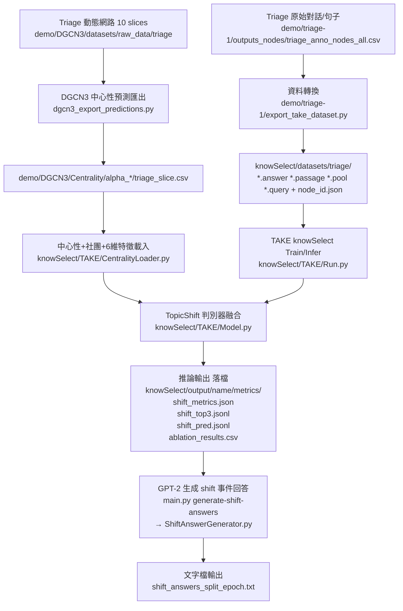

# TAKE × Tiage：需求對照、算法流程、可運行指南（含 Mermaid）

> 本文檔以 `docs/20260118需求.md` 為需求基準，對照目前專案程式碼與腳本，整理：
> - 算法/資料流程（含 Mermaid）
> - 需求 → 對應程式碼片段（檔案/函式/輸出檔）
> - 如何用 `scripts/*.sh` 執行與驗證（含 smoke check）

---

## 0. 名詞對齊（避免混淆）

- **Tiage**：本專案使用的對話資料集（節點對應句子）。
- **DGCN3**：對動態網路（10 slices）做節點中心性預測，輸出每個 slice 的中心性 CSV。
- **TAKE（knowSelect）**：本專案用作「話題轉移偵測/判別」與「知識選擇」的模型模組；本次需求聚焦於 **話題轉移輸出**。
- **shift**：話題轉移；本專案推論輸出採 **0=不轉移、1=轉移**。
- **turn_id**：以 `demo/tiage-1/outputs_nodes/tiage_anno_nodes_all.csv` 的 `turn_id` 為準，用於回溯原始資料列。

---

## 1. 需求摘要（取自 `docs/20260118需求.md` + 已確認補充）

### R1（DGCN3）

- 輸出路徑：`demo/DGCN3/Centrality/`
- 每個時間片一個 CSV，兩欄（node_id, centrality），無表頭
- 需輸出所有 10 個時間片（0–9）

### R2（TAKE 輸入）

TAKE 判別器輸入需包含：
- 句子 embedding（模型既有）
- 節點中心性（來自 DGCN3 預測）
- 節點所屬社團（每個時間片計算；已確認 node_id 不跨時間片，做法合理）

### R3（TAKE 輸出）

- **逐句 shift 預測標籤**落檔：0=不轉移、1=轉移，並包含可回溯資訊（turn_id）
- **每個 shift 事件**需生成回答（GPT‑2），直接寫入文字檔，並包含：
  - 轉移句
  - 轉移句中心性
  - 區間 Top‑3（中心性排序）句子，用於解釋關鍵資訊
  - turn_id（以 `tiage_anno_nodes_all.csv` 為準）
- 區間規則（已確認）：**包含本次 shift（含端點），不包含前一次 shift**

### R4（評價指標）

Precision / Recall / F1（shift）需落檔保存。

---

## 1.1 Tiage 時間片與資料切分（已確認）

### 時間片（slice）定義

- dialogs 依 `dialog_id` **數值排序**
- 每連續 **50 dialogs** 為一個 slice（允許最後一片 <50 dialogs）
- 允許 slices > 10

### TAKE（knowSelect）切分規則（選項 B）

- **Train**：slice **0–7**
- **Test**：slice **≥8**

> 專案實作落點：`tools/generate_tiage_split_by_dialog_slices.py` + `scripts/generate_tiage_split.sh`

## 2. 算法流程（Mermaid）

### 2.1 整體 Pipeline



---

## 3. 需求 → 程式碼對照（關鍵片段）

> 這裡以「對應檔案/函式/輸出檔」方式呈現；需要追程式時可直接跳到對應檔案。

### 3.1 R1：DGCN3 輸出

- **輸出入口**
  - `scripts/run_export_centrality_tiage.sh` → `main.py export-centrality` → `dgcn3_export_predictions.py`
- **輸出格式（兩欄、無表頭）**
  - `dgcn3_export_predictions.py`：`to_csv(index=False, header=False)`
- **輸出範圍（0–9）**
  - `dgcn3_export_predictions.py`：`timesteps = list(range(len(dataset)))`

### 3.2 R2：中心性 + 社團 + 6 維特徵進判別器

- **特徵載入/社團**
  - `knowSelect/TAKE/CentralityLoader.py`
    - 讀取 `demo/DGCN3/Centrality/alpha_*/tiage_{slice}.csv`
    - 對每 slice edge list 以 Louvain 計算社團
    - 建 6 維特徵 + `node_id -> turn_id` 對照（回溯用）
- **模型融合**
  - `knowSelect/TAKE/Model.py`
    - 從 batch 的 `node_ids` 取特徵
    - 經 `CentralityCommunityEncoder` 編碼後拼接到 TopicShift Discriminator 的 fusion 向量

### 3.3 R3：逐句 shift 標籤 + 區間 Top‑3（含 turn_id）落檔

- **逐句 shift（0/1）落檔**
  - `knowSelect/TAKE/CumulativeTrainer.py`
    - 推論時計算 `ID_pred`
    - 追加寫入：`knowSelect/output/<name>/metrics/shift_pred.jsonl`
    - 欄位：`dialog_id, query_id, turn_id, node_id, pred_shift`
- **區間 Top‑3（含 turn_id）**
  - `knowSelect/TAKE/CumulativeTrainer.py`
    - 在 `shift_top3.jsonl` 的每條 record 增加 `shift_events`
    - 每個 shift 事件含：
      - `shift_sentence / shift_centrality / shift_turn_id`
      - `interval_top3[*].turn_id`（可回溯）
      - 區間規則：包含本次 shift、不包含前一次 shift

### 3.4 R3：每個 shift 事件用 GPT‑2 生成回答（文字檔）

- **生成器**
  - `knowSelect/TAKE/ShiftAnswerGenerator.py`
    - 讀 `shift_top3.jsonl` → 對每個 `shift_events` 產生 prompt → GPT‑2 generate
    - 輸出 `shift_answers_<split>_<epoch>.txt`
- **CLI**
  - `main.py generate-shift-answers`
- **腳本入口**
  - `scripts/run_generate_shift_answers_tiage.sh`

### 3.5 R4：P/R/F1（shift）落檔

- `knowSelect/TAKE/CumulativeTrainer.py`
  - `metrics/shift_metrics.json`
  - `metrics/ablation_results.csv`

---

## 4. 如何運行（只用 scripts）

> 前置：需先建立 `.venv`（請用 `scripts/setup_env.sh`）。

### 4.1 環境建立

```bash
bash scripts/setup_env.sh
```

### 4.2 產生中心性（DGCN3）

```bash
bash scripts/run_export_centrality_tiage.sh
```

### 4.3 訓練 + 推論（TAKE/knowSelect）

```bash
bash scripts/run_tiage_pipeline.sh
```

或拆開：

```bash
bash scripts/generate_tiage_split.sh
bash scripts/run_take_tiage_train.sh
bash scripts/run_take_tiage_infer.sh
```

### 4.4 生成 shift 事件 GPT‑2 回答文字檔

```bash
bash scripts/run_generate_shift_answers_tiage.sh
```

---

## 5. 測試/驗證（Smoke Check）

專案目前沒有傳統單元測試；本倉庫提供 **輸出 smoke check** 來驗證落檔是否齊全且欄位正確：

```bash
bash scripts/smoke_check_tiage_outputs.sh
```

---

## 6. 腳本正確性檢查（靜態）

本節只做「路徑/參數/輸出位置」靜態核對（不含實際跑訓練）。

- `scripts/run_export_centrality_tiage.sh`
  - 呼叫 `main.py export-centrality`，會輸出到 `demo/DGCN3/Centrality/`
- `scripts/run_tiage_pipeline.sh`
  - 呼叫 `main.py pipeline`，會依序：匯出中心性 → 训练 → 推論
- `scripts/run_take_tiage_infer.sh`
  - 推論後應產生：`knowSelect/output/<name>/metrics/shift_metrics.json`、`shift_top3.jsonl`、`shift_pred.jsonl`
- `scripts/run_generate_shift_answers_tiage.sh`
  - 讀取 `shift_top3.jsonl`，輸出 `shift_answers_test_all.txt`（預設 split=test, epoch=all）

