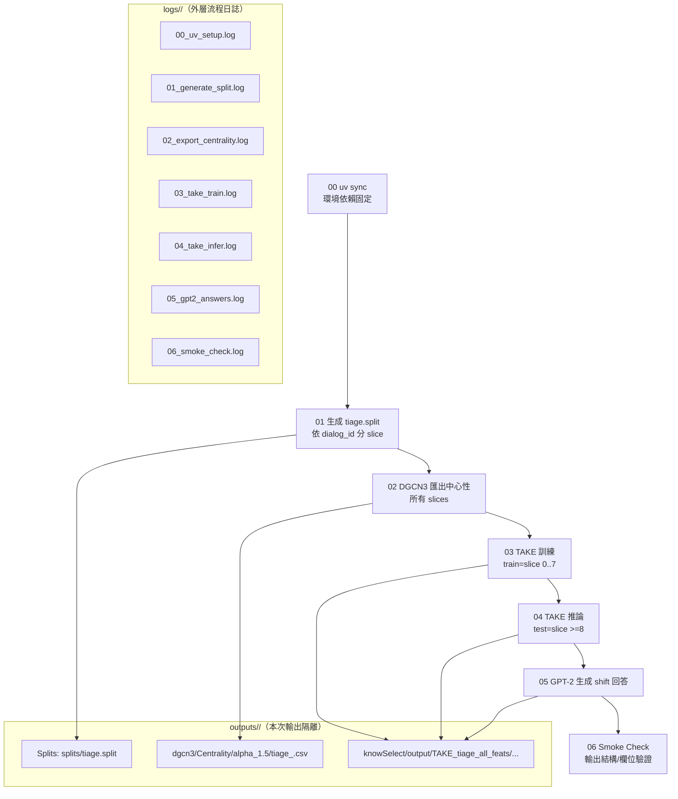
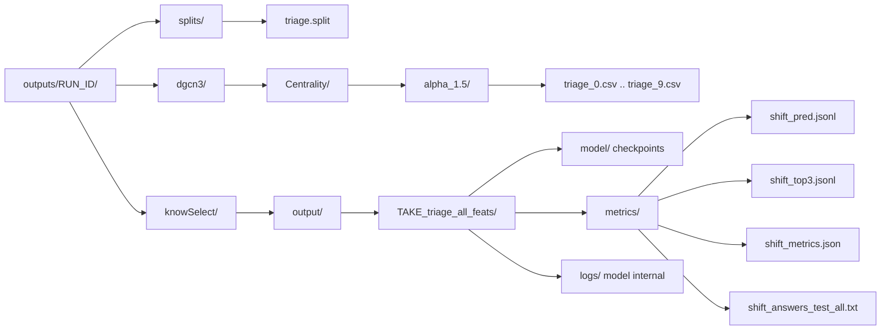

# 完整產出說明（Tiage｜uv｜時間片切分版）

> 目的：說明「理論上流程順利跑完後」你應該會得到哪些輸出（含用途/中間或最終產物/依賴關係），並用 Mermaid 視覺化 pipeline 與 outputs/logs 結構。

---

## 0. 重要約定：每次 run 的隔離

- **RUN_ID**：一鍵腳本每次啟動會自動產生時間戳，例如 `2026-01-18_15-30-05`。
- **本次運行日誌**：`logs/<RUN_ID>/`
- **本次運行輸出**：`outputs/<RUN_ID>/`
- **對齊排查**：同一個 `<RUN_ID>` 下的 `logs/` 與 `outputs/` 對應同一次完整流程。

---

## 1. Pipeline 與產物關係（Mermaid）

---

## 2. 你會得到哪些「日誌」？

### 2.1 外層流程日誌（推薦用於追蹤進度/定位錯誤）

位置：`logs/<RUN_ID>/`

- **特性**：
  - 每一步獨立一個 log 檔，便於快速定位是哪一步壞掉
  - 每一步包含：
    - `START`/`END` 時間戳
    - `duration_sec`
    - `rc`（錯誤碼；非 0 代表該步驟失敗）
    - stdout + stderr（含 traceback）

### 2.2 內層模型日誌（模型/訓練框架自己寫出的 log）

位置（以本次輸出隔離為例）：

- `outputs/<RUN_ID>/knowSelect/output/TAKE_tiage_all_feats/logs/`

---

## 3. 你會得到哪些「輸出結果」？

### 3.1 `outputs/<RUN_ID>/splits/`

- **`tiage.split`（最終：可稽核配置）**
  - **用途**：記錄本次 run 的 train/test 切分標籤（供回溯/再現）。
  - **依賴**：由 `demo/tiage-1/outputs_nodes/tiage_anno_nodes_all.csv` 的 `dialog_id` 進行數值排序與分 slice 產生。
  - **注意**：實際被 TAKE 使用的檔案仍在 `knowSelect/datasets/tiage/tiage.split`；此處是「本次 run 的備份副本」。

### 3.2 `outputs/<RUN_ID>/dgcn3/Centrality/`

- **`alpha_1.5/tiage_<slice>.csv`（中間產物：TAKE 的特徵來源）**
  - **用途**：每個時間片網路快照的節點中心性預測（供 TAKE 的 CentralityLoader 融合）。
  - **依賴**：DGCN3 對 `demo/DGCN3/datasets/raw_data/tiage` 的時間片資料跑推論後匯出。
  - **下游**：被 TAKE 讀取（`--dgcn-predictions-dir`）用來生成結構特徵與話題轉移判斷輸入。

### 3.3 `outputs/<RUN_ID>/knowSelect/output/TAKE_tiage_all_feats/`

> 下列路徑的 `<NAME>` 即 `TAKE_tiage_all_feats`。若你更換實驗名，目錄會跟著變。

#### (A) `model/`（中間產物：checkpoint）

- **用途**：訓練階段產生的模型權重/檢查點。
- **依賴關係**：`model/` → 推論（inference）→ `metrics/`（預測與評估）

#### (B) `metrics/`（最終產物為主：推論輸出與評估）

- **`shift_pred.jsonl`（最終）**
  - **用途**：每句話的二元話題轉移預測（0=未轉移，1=轉移），並含可回溯欄位（`dialog_id/query_id/turn_id/node_id`）。
- **`shift_top3.jsonl`（最終）**
  - **用途**：將 shift 事件整理成 `shift_events`，並對每個 shift 計算「區間 top3 中心性句子」：
    - **區間規則**：包含本次 shift（含端點），不包含前一次 shift（不含端點），避免相鄰區間重複。
  - **欄位**：包含 `interval_start_turn_id/interval_end_turn_id`、`interval_top3[*].turn_id` 等，便於定位原始資料。
- **`shift_metrics.json`（最終）**
  - **用途**：話題轉移相關的整體指標彙總（用於快速比較實驗）。
- **`shift_answers_<split>_<epoch>.txt`（最終）**
  - **用途**：對每個 shift 事件，用 GPT-2 產生一段回答文字（包含 shift 句、中心性、區間 top3 句等作為 prompt 內容）。
  - **範例**：`shift_answers_test_all.txt`

#### (C) `logs/`（中間產物：模型內部日誌）

- **用途**：模型訓練/推論過程中由框架寫出的 log（與外層 `logs/<RUN_ID>/` 不同層級）。

---

## 4. 產物結構（Mermaid）

---

## 5. 常見依賴關係（快速排障用）

- **DGCN3 缺檔**（`dgcn3/Centrality/...` 不存在）→ TAKE 可能無法載入中心性特徵或特徵退化  
  - 優先查看：`logs/<RUN_ID>/02_export_centrality.log`
- **`tiage.split` 有變更但訓練/推論結果不變** → 可能是舊的 `*_TAKE.pkl` 快取未清掉  
  - 本專案腳本已在 train/infer 前刪除相關 pkl；若你自訂流程，需自行注意
- **推論沒有產生 `shift_pred.jsonl` / `shift_top3.jsonl`** → 推論步驟未成功或輸出路徑不對  
  - 優先查看：`logs/<RUN_ID>/04_take_infer.log`
  - 再看：`outputs/<RUN_ID>/knowSelect/output/TAKE_tiage_all_feats/logs/`

