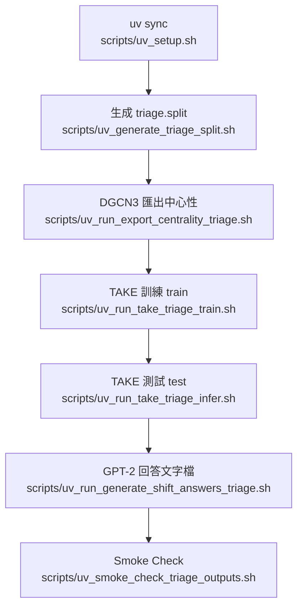

# 完整訓練/測試流程（Tiage｜uv 版）

> 目的：提供一套「可直接照跑」的完整流程，從環境→時間片切分→中心性→訓練→測試→輸出→驗證，全程只透過 `scripts/*.sh`，並以 `uv` 作為主要執行工具。

---

## 0. 前置說明（你已定案的規則）

### 0.1 Tiage 時間片（slice）規則

- dialogs 依 `dialog_id` **數值排序**
- 每連續 **50 dialogs = 1 slice**
- 允許：
  - 最後一片 <50 dialogs
  - slices > 10

### 0.2 TAKE 切分（選項 B）

- **Train**：slice **0–7**
- **Test**：slice **≥8**

### 0.3 DGCN3

- **不做資料集切分**
- 對所有 slices 輸出中心性預測（供 TAKE 使用）

---

## 1. 一鍵完整流程（推薦）

**你只需要跑這一條：**

```bash
bash scripts/uv_run_tiage_train_test.sh
```

---

## 2. 逐步流程（每一步的意義 + 輸入/輸出）

### Step 0：同步環境（uv）

**意義**
- 依 `uv.lock` 固定版本同步依賴，確保可重現。

**命令**

```bash
bash scripts/uv_setup.sh
```

**輸出**
- `uv` 管理的 `.venv/`（由 uv 建立/維護）

---

### Step 1：生成 `tiage.split`（時間片切分）

**意義**
- 讓 TAKE（knowSelect）真正依 slice 切分 train/test。

**命令**

```bash
bash scripts/uv_generate_tiage_split.sh
```

**輸入**
- `demo/tiage-1/outputs_nodes/tiage_anno_nodes_all.csv`

**輸出**
- `knowSelect/datasets/tiage/tiage.split`
  - 每行：`<dialog_id>_0<TAB>train|test`

---

### Step 2：DGCN3 匯出中心性（所有 slices）

**意義**
- 產生每個 slice 的節點中心性預測，供 TAKE 的 topic-shift 判別器融合。

**命令**

```bash
bash scripts/uv_run_export_centrality_tiage.sh
```

**輸入**
- `demo/DGCN3/datasets/raw_data/tiage/`（已切好的時間片網路）
- `demo/DGCN3/model_registry/node_importance_tiage.pkl`（DGCN3 checkpoint；若不存在會報錯）

**輸出**
- `demo/DGCN3/Centrality/alpha_1.5/tiage_<slice>.csv`

---

### Step 3：TAKE 訓練（train）

**意義**
- 用 train split（slice 0–7）訓練 knowSelect 模型（含中心性/社團/6 維結構特徵）。
- 腳本內會清理舊的 `*_TAKE.pkl`，確保切分生效。

**命令**

```bash
bash scripts/uv_run_take_tiage_train.sh
```

**輸出**
- `knowSelect/output/TAKE_tiage_all_feats/model/`

---

### Step 4：TAKE 測試推論（test）

**意義**
- 對 test split（slice ≥8）推論並落檔：
  - 逐句 shift 0/1
  - shift 事件與「區間 Top-3」（包含本次 shift、不包含前一次 shift）
  - P/R/F1 指標

**命令**

```bash
bash scripts/uv_run_take_tiage_infer.sh
```

**輸出**
- `knowSelect/output/TAKE_tiage_all_feats/metrics/`
  - `shift_pred.jsonl`
  - `shift_top3.jsonl`
  - `shift_metrics.json`
  - `ablation_results.csv`

---

### Step 5：每個 shift 事件用 GPT-2 生成回答（文字檔）

**意義**
- 讀取 `shift_top3.jsonl` 的 `shift_events`，為每個 shift 事件生成一段 GPT‑2 回答並寫到文字檔。

**命令**

```bash
bash scripts/uv_run_generate_shift_answers_tiage.sh
```

**輸出**
- `knowSelect/output/TAKE_tiage_all_feats/metrics/shift_answers_<split>_<epoch>.txt`

---

### Step 6：Smoke Check（輸出驗證）

**意義**
- 檢查關鍵輸出檔是否存在、欄位是否齊全、取值是否合理（不跑訓練）。

**命令**

```bash
bash scripts/uv_smoke_check_tiage_outputs.sh
```

---

## 3. 流程總覽（Mermaid）



