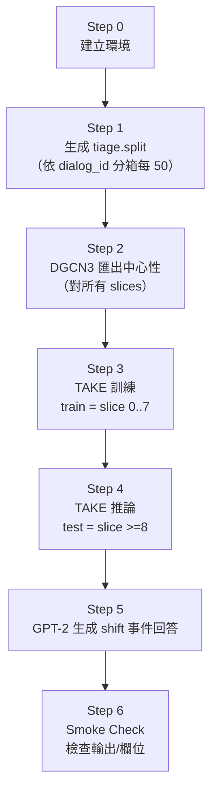

# 腳本運行指南（Tiage｜時間片切分版）

> 目的：用 **scripts** 封裝完整流程，說明每一步要跑哪個腳本、每一步的意義、以及輸入/輸出位置，並用 Mermaid 呈現流程。
>
> 時間片/切分規則（已批准）：
> - dialogs 依 `dialog_id` **數值排序**
> - 每 **50 dialogs = 1 slice**（允許最後一片 <50）
> - 允許 slices > 10
> - TAKE 切分（選項 B）：**Train = slice 0–7；Test = slice ≥8**
> - DGCN3：**不切分**，對所有 slices 輸出中心性預測

---

## 1. 整體流程（Mermaid）



---

## 2. 每一步怎麼跑（只用 scripts）

### Step 0：建立 Python 環境

**目的**
- 建立 `.venv`，讓後續腳本都能用同一套相依套件。

**執行**

```bash
bash scripts/setup_env.sh
```

**輸出**
- `.venv/`

---

### Step 1：生成/更新 `tiage.split`（時間片切分）

**目的**
- 依你定義的時間片切法（`dialog_id` 數值排序、每 50 dialogs 一片）生成 knowSelect 會讀的 `knowSelect/datasets/tiage/tiage.split`。
- TAKE 依此 split 決定 train/test（train=0..7，test>=8）。

**執行**

```bash
bash scripts/generate_tiage_split.sh
```

**輸入**
- `demo/tiage-1/outputs_nodes/tiage_anno_nodes_all.csv`

**輸出**
- `knowSelect/datasets/tiage/tiage.split`

---

### Step 2：DGCN3 匯出中心性（所有時間片）

**目的**
- 對所有 slices（0–9，或更多）輸出中心性預測 CSV，供 TAKE 融合使用。

**執行**

```bash
bash scripts/run_export_centrality_tiage.sh
```

**輸入**
- `demo/DGCN3/datasets/raw_data/tiage/`（已切好的時間片網路）
- `demo/DGCN3/model_registry/node_importance_tiage.pkl`（已訓練 checkpoint；若不存在會報錯）

**輸出**
- `demo/DGCN3/Centrality/alpha_1.5/tiage_<slice>.csv`（兩欄無表頭：node_id, centrality）

---

### Step 3：TAKE 訓練（train split）

**目的**
- 依 `tiage.split` 的 train 部分訓練 knowSelect（含中心性/社團/6 維特徵融合）。
- **注意**：若你更新了 `tiage.split`，必須刪除舊的 `*_TAKE.pkl`，否則會沿用舊切分。本專案已在腳本內自動刪除。

**執行**

```bash
bash scripts/run_take_tiage_train.sh
```

**輸出（主要）**
- `knowSelect/output/TAKE_tiage_all_feats/model/`（checkpoint）

---

### Step 4：TAKE 推論（test split）

**目的**
- 依 `tiage.split` 的 test 部分做推論，保存測試集輸出（含逐句 shift、區間 Top‑3、指標等）。
- **注意**：腳本會刪除舊 `test_TAKE.pkl` 以確保套用最新 split。

**執行**

```bash
bash scripts/run_take_tiage_infer.sh
```

**輸出（主要）**
- `knowSelect/output/TAKE_tiage_all_feats/metrics/`
  - `shift_metrics.json`（Precision/Recall/F1）
  - `shift_pred.jsonl`（逐句 shift 0/1，含 turn_id）
  - `shift_top3.jsonl`（shift_events + 區間 Top‑3，Top‑3 內含 turn_id）
  - `ablation_results.csv`

---

### Step 5：GPT‑2 生成 shift 事件回答（文字檔）

**目的**
- 讀取 `shift_top3.jsonl` 的 `shift_events`，對每個 shift 事件產生「回答」並寫到文字檔（可回溯 turn_id）。

**執行**

```bash
bash scripts/run_generate_shift_answers_tiage.sh
```

**輸出**
- `knowSelect/output/TAKE_tiage_all_feats/metrics/shift_answers_<split>_<epoch>.txt`
  - 預設腳本使用：`split=test`、`epoch=all`

---

### Step 6：Smoke Check（輸出驗證）

**目的**
- 不跑訓練，只檢查關鍵輸出檔是否存在、欄位是否齊全、取值是否合理。

**執行**

```bash
bash scripts/smoke_check_tiage_outputs.sh
```

---

## 3. 一鍵跑完整流程（建議）

若你想直接跑完整流程（會自動生成 split，並依序匯出中心性/訓練/推論）：

```bash
bash scripts/run_tiage_pipeline.sh
```

完成後再補：

```bash
bash scripts/run_generate_shift_answers_tiage.sh
bash scripts/smoke_check_tiage_outputs.sh
```

