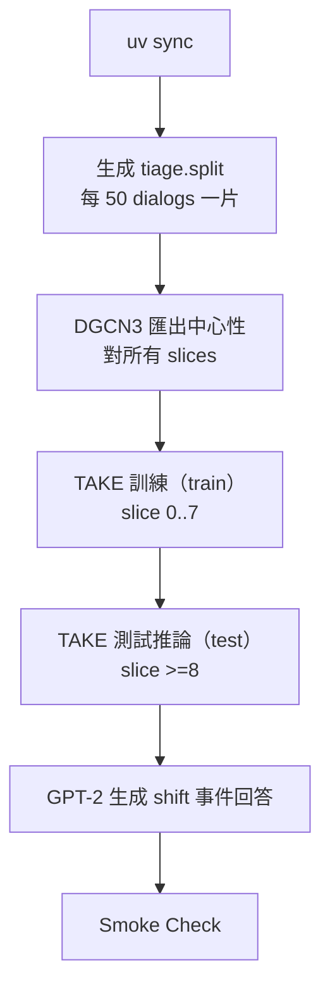

# Scripts（本次整理後）

> 本目錄已依你的要求整理：
> - Unix/macOS 腳本集中在 `scripts/unix/`
> - Windows 腳本集中在 `scripts/windows/`
> - 僅保留本次新增的「Tiage 時間片切分 + uv 完整訓練/測試」流程

---

## 0. 完整流程（Tiage｜uv 版）

### 一鍵執行（推薦）

#### macOS / Linux

```bash
bash scripts/unix/uv_run_tiage_train_test.sh
```

#### Windows（PowerShell）

```powershell
powershell -ExecutionPolicy Bypass -File scripts\windows\uv_run_tiage_train_test.ps1
```

---

## 1. 流程總覽（Mermaid）



---

## 2. 逐步腳本（每一步的意義）

> Tiage 時間片/切分規則（已定案）：
> - dialogs 依 `dialog_id` **數值排序**
> - 每 50 dialogs = 1 slice（允許最後一片 <50；允許 slices >10）
> - TAKE：Train = slice 0–7；Test = slice ≥8
> - DGCN3：不切分，對所有 slices 匯出中心性

### Step 0：同步環境（uv）

- **意義**：依 `uv.lock` 固定版本同步依賴，確保可重現。
- **Unix**：`bash scripts/unix/uv_setup.sh`
- **Windows**：`powershell -ExecutionPolicy Bypass -File scripts\windows\uv_setup.ps1`

### Step 1：生成 `tiage.split`

- **意義**：讓 TAKE（knowSelect）依時間片切分 train/test。
- **Unix**：`bash scripts/unix/uv_generate_tiage_split.sh`
- **Windows**：`powershell -ExecutionPolicy Bypass -File scripts\windows\uv_generate_tiage_split.ps1`
- **輸出**：`knowSelect/datasets/tiage/tiage.split`

### Step 2：DGCN3 匯出中心性（所有 slices）

- **意義**：產生每個 slice 的中心性預測 CSV，供 TAKE 融合使用。
- **Unix**：`bash scripts/unix/uv_run_export_centrality_tiage.sh`
- **Windows**：`powershell -ExecutionPolicy Bypass -File scripts\windows\uv_run_export_centrality_tiage.ps1`
- **輸出**：`demo/DGCN3/Centrality/alpha_1.5/tiage_<slice>.csv`

### Step 3：TAKE 訓練（train）

- **意義**：用 train split（slice 0–7）訓練模型。腳本會清理舊的 `*_TAKE.pkl` 以確保切分生效。
- **Unix**：`bash scripts/unix/uv_run_take_tiage_train.sh`
- **Windows**：`powershell -ExecutionPolicy Bypass -File scripts\windows\uv_run_take_tiage_train.ps1`

### Step 4：TAKE 測試推論（test）

- **意義**：對 test split（slice ≥8）推論並落檔（shift_pred/shift_top3/shift_metrics）。
- **Unix**：`bash scripts/unix/uv_run_take_tiage_infer.sh`
- **Windows**：`powershell -ExecutionPolicy Bypass -File scripts\windows\uv_run_take_tiage_infer.ps1`

### Step 5：GPT-2 生成 shift 事件回答（文字檔）

- **意義**：讀取 `shift_top3.jsonl` 的 shift_events，對每個 shift 事件生成回答並寫入文字檔。
- **Unix**：`bash scripts/unix/uv_run_generate_shift_answers_tiage.sh`
- **Windows**：`powershell -ExecutionPolicy Bypass -File scripts\windows\uv_run_generate_shift_answers_tiage.ps1`

### Step 6：Smoke Check（輸出驗證）

- **意義**：檢查輸出檔是否存在、欄位是否齊全、取值是否合理（不跑訓練）。
- **Unix**：`bash scripts/unix/uv_smoke_check_tiage_outputs.sh`
- **Windows**：`powershell -ExecutionPolicy Bypass -File scripts\windows\uv_smoke_check_tiage_outputs.ps1`
